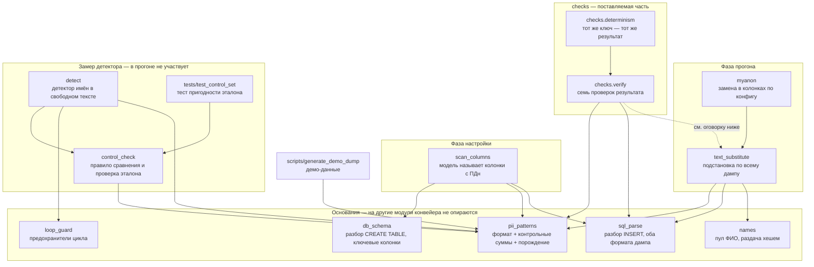

# Санитизация базы MySQL

Решение тестового задания: база с персональными данными на входе — та же база
без них на выходе, с сохранёнными связями, объёмом и разнообразием данных.

Документ описывает, что сделано и чем это подтверждено. Все числа получены
прогоном проверочных скриптов, а не оценкой на глаз.

---

## Текст задания

> На вход подаем бд — на выход получаем бд, но которая очищена от конф и
> персональных данных.

> Пусть подготовит и задеплоит решение для санитизации бд на mysql.
> Как проверять: продуктовая часть — смог продумать и логично объяснил
> выбранный формат решения; техническая — проресерчил опенсорс и доработал
> его; использовал ллм для логичных замен; внедрил сквозные замены; бд после
> санитизации сохранила все связи и объем и разнообразие данных.

Дополнительные вводные: база для тестового произвольная, срок — до конца недели.

---

## Что сделано — по каждому пункту проверки

| Пункт | Чем закрыт | Подтверждение |
|---|---|---|
| Объяснить выбранный формат решения | этот документ | — |
| Проресерчить опенсорс и доработать | myanon выбран из пяти кандидатов и доработан вторым слоем | на сегодняшнем конфиге после одного лишь myanon в дампе оставалось 131 исходное значение из 186 |
| Использовать ллм для логичных замен | модель находит, детерминированный механизм заменяет: сканер определяет колонки с ПДн и через код настраивает myanon, детектор ищет имена в свободном тексте. Что из этого уже работает, а что нет — в разделе «Состояние работ», без округлений | сканер: 3 колонки принято, 14 отклонено детерминированными фильтрами; относительно ручного конфига добавил пропущенное и убрал лишнее. Детектор: 10 из 10 найдено, 0 ложных на 13 отрицательных примерах |
| Внедрить сквозные замены | одно значение заменяется одинаково в колонке и в тексте | 186 пар проверено, расхождений 0 |
| Сохранить связи, объём, разнообразие | замены сохраняют вид данных, строки не удаляются | 30/15/60/60 строк, разнообразие совпадает везде |

---

## Как устроено решение

Вход и выход — база MySQL. Решение состоит из двух фаз: **настройка** — один
раз на новую базу, с участием человека, и **прогон** — сколько угодно раз,
без человека и без модели.

<picture>
  <source media="(prefers-color-scheme: dark)" srcset="docs/assets/architecture-dark.png">
  
</picture>

Схема собрана из типизированного описания
[`docs/architecture.archify.json`](docs/architecture.archify.json) — её можно
пересобрать и проверить на пересечения линий и наложения подписей машинно, а не
глазами. Интерактивная версия с переключением между фазами —
`docs/architecture.html`.

Исходный дамп нужен обоим этапам: по паре «исходный / после этапа 1» второй
этап восстанавливает, чем myanon заменил каждое значение.

**Фаза прогона запускается одной командой и ручных шагов не требует.** Фаза
настройки требует одного: человек смотрит дифф конфига и принимает его.
Подробно — в разделе «Цикл автонастройки».

### Этап 1 — открытый инструмент

**[myanon](https://github.com/ppomes/myanon)** (лицензия Modified BSD): читает
дамп потоком, к рабочей базе не подключается, заменяет значения в колонках,
перечисленных в конфиге. Перечень не пишется руками — его определяет фаза
настройки. Одинаковое значение всегда получает одинаковую замену: это встроено
в механику myanon, а не настраивается.

Выбран из пяти кандидатов. Причины отсева проверялись по первоисточнику —
чтением кода и `git log`, а не по описанию на странице проекта:

| Кандидат | Почему не подошёл |
|---|---|
| [gdpr-dump](https://github.com/Smile-SA/gdpr-dump) | лицензия GPL-3.0 — копилефт, обязывает открывать производный код |
| [Greenmask](https://github.com/GreenmaskIO/greenmask) | поддержка MySQL в пререлизном состоянии — [эпик #222](https://github.com/GreenmaskIO/greenmask/issues/222) ещё не закрыт |
| [nxs-data-anonymizer](https://github.com/nixys/nxs-data-anonymizer) | разработка фактически остановлена: последний коммит 22.09.2025 |
| [Neosync](https://github.com/nucleuscloud/neosync) | репозиторий архивирован владельцем |
| [Datanymizer](https://github.com/datanymizer/datanymizer) | MySQL в README помечен как невыполненный пункт: `- [ ] MySQL or MariaDB (TODO)` |

Состояние кандидатов перепроверено 10.09.2026 запросами к API GitHub. Это
факты на дату: эпик Greenmask может закрыться, а разработка возобновиться.

Честная оговорка: у gdpr-dump сквозная замена тоже подтверждена кодом, и по
кириллице он сильнее — у него готовая русская локаль генератора из коробки.
Решающей оказалась лицензия. Если копилефт для вас приемлем, gdpr-dump —
достойная альтернатива, и выбор стоит пересмотреть.

### Этап 2 — доработка, ради которой всё и делалось

myanon применяет правило к значению поля целиком и внутрь строки не смотрит.
Телефон, заменённый в своей колонке, остаётся открытым в комментарии, где он
упомянут текстом.

**Замерено: после одного лишь этапа 1 в дампе остаётся 131 исходное значение
из 186, и 32 комментария из 60 содержат персональные данные открытым текстом.**

Число привязано к конкретному конфигу — тому, что запускается сегодня. С другим
перечнем колонок оно будет другим. Неизменно другое: сколько бы колонок ни
перечислили в конфиге, значения, упомянутые внутри свободного текста, myanon не
тронет никогда — он не смотрит внутрь строки. Дыра не в конфиге, а в границе
инструмента.

Настройкой это не закрывается: единственное, что можно сделать конфигом со
свободным текстом, — захешировать комментарий целиком, уничтожив сам текст.
Дыра принципиально требует доработки — это и есть «доработал опенсорс».

Доработка строит карту «исходное значение → его замена» из трёх источников и
делает один проход подстановки по всему дампу:

1. **Из колонок.** Пары «было → стало» восстанавливаются сопоставлением
   исходного и обработанного дампов по позиции строк. Внутренний алгоритм
   myanon не воспроизводится — замены берутся из его же вывода, поэтому
   обновление инструмента ничего не ломает.
2. **По формату.** Телефон, ИНН, СНИЛС, почта, найденные в тексте и ещё не
   попавшие в карту. Сюда попадают и реквизиты третьих лиц, которых нет ни в
   одной таблице, — курьера, подрядчика. С проверкой контрольных сумм:
   значение с неверной суммой не заменяется, потому что это не персональные
   данные.
3. **Имена в свободном тексте.** Единственный вид персональных данных, у
   которого нет ни строгого формата, ни источника в колонках. Здесь работает
   языковая модель.

### Как сквозная замена выглядит на самом деле

Одна запись из демо-набора, до и после. Это и есть то, чего myanon из коробки
не делает и ради чего понадобилась доработка:

```
customers.inn
  было : 386379402608
  стало: 562356013946

orders.comment у того же клиента
  было : ИНН клиента для документов: 386379402608.
  стало: ИНН клиента для документов: 562356013946.
```

Одно и то же новое значение по обе стороны границы «колонка / свободный текст».
Порождённый ИНН при этом валиден по обеим контрольным цифрам, то есть остаётся
ИНН, а не превращается в мусор.

---

## Из каких модулей состоит

Граф снят с кода разбором импортов на действующей раскладке, а не нарисован
по памяти.



**Чего в графе нет намеренно.** Модуль `paths` — от него зависят семеро, но
он разрешает пути к данным и к частям конвейера отношения не имеет; семь
линий к нему сделали бы картинку нечитаемой. Он появился при переходе на
каталоги: до этого имена файлов данных разрешались относительно текущего
каталога, и перемещение модуля меняло поведение молча.

Оркестрация — не в Python: `scripts/sanitize.sh` запускает myanon и
`text_substitute`, `scripts/entrypoint.sh` замыкает цепочку от базы до базы
и зовёт проверки, `docker-compose.yml` поднимает всё вместе.

**`pii_patterns` — узел, от которого зависят шестеро.** Это намеренно: правило
«что распознаётся по формату, то и обрабатывается по формату» должно жить в
одном месте, иначе распознавание и порождение разойдутся. Один и тот же модуль
и находит значение, и порождает ему замену того же вида.

**`control_check` лежит в пакете, а не в `tests/`** — хотя по названию это
проверка. Его импортирует `detect`: правило сравнения найденного с размеченным
одно и то же и в замере, и в тесте. Разведи их — и замер начнёт мерить одним
правилом, а тест проверять другим. В `tests/` лежит тест поверх этого модуля.

**Оговорка, которую нашёл этот же разбор.** `checks.verify` импортирует из
`text_substitute` перечень колонок и функцию построения карты замен. То есть
проверяющий частично построен на коде того, что проверяет: ошибка в построении
карты стала бы для проверки невидимой, потому что проверка пользуется той же
картой. Это не гипотетический класс — в этой работе уже дважды случалось, что
ложный результат давал инструмент проверки, а не измеряемое. Правильно
развязать: перечень колонок вынести в общие данные, а карту в проверке строить
независимо. Не сделано.

---

## Что заменяется и на что

| Вид данных | Кто обрабатывает | Чем заменяется | Что сохраняется |
|---|---|---|---|
| ФИО | myanon по конфигу | `texthash` | длина, признак заполненности |
| Адрес | myanon по конфигу | `texthash` | длина, признак заполненности |
| Телефон | слой подстановки, по формату | порождённый номер | формат `+7 9XX XXX-XX-XX` |
| ИНН (12 знаков) | слой подстановки, по формату | порождённый ИНН | обе контрольные цифры верны |
| СНИЛС | слой подстановки, по формату | порождённый СНИЛС | контрольное число верно |
| Почта | слой подстановки, по формату | порождённый адрес | домен целиком |

Правило простое: **что распознаётся по формату — берёт слой подстановки, что
не распознаётся — идёт в конфиг myanon.** Граница проведена не по удобству, а
по доказуемости: у телефона, ИНН, СНИЛС и почты есть проверяемый формат, а у
имени и адреса его нет.

Из этого правила следует и разделение труда с моделью: сканер спрашивают
только про то, чего формат не берёт.

**Чем это отличается от того, что запускается сегодня.** Сегодняшний конфиг
написан руками и содержит `email` и `address`; ФИО заменяются механизмом, от
которого решено отказаться (см. «Состояние работ»). Сканер на этой же базе
предлагает `full_name` и `address`, а почту отбрасывает как покрытую форматным
слоем. Проверено, что это не потеря: форматный слой сохраняет домен так же,
как `emailhash` — `customer1@example-mail.ru` превращается в
`nqqoxnhftw@example-mail.ru`. Выигрыш в том, что на один вид данных остаётся
один механизм вместо двух.

Цена нарушения этого правила проверена на себе: в ранней версии телефон стоял
и в конфиге, и в форматном слое — в колонке он превращался в буквенный мусор,
а в тексте в правильный номер. Один вид данных, два разных результата в одной
базе.

**Не заменяется по решению исполнителя:** город, отдел, номенклатура, даты.
Сами по себе они человека не идентифицируют, а их замена разрушила бы
аналитическую ценность базы.

**Суммы не заменяются не по решению, а потому что не задан их статус.**
В задании конфиденциальные данные — отдельная категория, и она не
расшифрована. Механизм для них есть и проверен: 60 уникальных сумм заказов
остались 60 уникальными, 36 сумм платежей — 36, и связь между таблицами по
значению уцелела полностью. Оговорка: используемое преобразование работает с
целыми, дробная часть теряется — `350033.02` превращается в `512862`.

**ИНН из 10 знаков не распознаётся намеренно.** Он принадлежит юридическому
лицу, а не человеку, и у него одна контрольная цифра: случайный десятизначный
номер заказа проходит проверку примерно в одном случае из одиннадцати. Цена
ложных срабатываний выше пользы.

---

## Ключ замен

Замены определяются ключом, который передаётся через окружение и не хранится
ни в репозитории, ни в конфиге, ни в образе: временный конфиг создаётся с
правами 600 и удаляется при любом завершении, включая прерывание.

Оба свойства проверены машинно:

- один и тот же ключ даёт один и тот же результат — прогоны воспроизводимы;
- другой ключ даёт другие замены — по двум выгрузкам с разными ключами нельзя
  сопоставить записи.

Ключ — единственное, что связывает исходное значение с заменой. Замены строятся
на HMAC-SHA256.

---

## Роль языковой модели

**Модель находит, детерминированный механизм заменяет.** Это разделение
получено замером, а не выбрано из вкуса.

### Почему модель не порождает замены

Проверялись оба варианта.

Если модель придумывает замену на каждое уникальное значение независимыми
запросами, она тяготеет к частотным именам: **20 исходных ФИО с 10 разными
фамилиями превратились в 7 ФИО с 4 фамилиями**, два разных клиента слились в
одного. Это ломает требование сохранить разнообразие.

Один запрос с просьбой выдать 30 разных ФИО даёт 30 разных ФИО, среди них 29
разных фамилий, — дело не в неспособности модели. Дело в том, что разнообразие тогда держится на её
поведении, а не гарантируется построением. При раздаче хешем оно гарантировано.

Дополнительно: правдоподобная замена — это синтетические персональные данные,
неотличимые от настоящих. Очищенную базу нельзя отличить от боевой по
содержимому, а по этому признаку принимают решения о том, где её хранить и
кому показывать.

### Что модель делает

Ищет имена людей в свободном тексте. Телефон, ИНН, СНИЛС и почту берёт
форматный слой с проверкой контрольных сумм, где полнота доказуема
арифметикой; менять доказуемое на вероятное там незачем.

Размер дыры измерен: детерминированный слой находит **8 из 8** значений
строгого формата и **0 из 10** имён в свободном тексте.

### Замер детектора

Контрольный размеченный набор: 27 записей, 14 с персональными данными, 13 без.
Тексты написаны вручную и не порождены генератором демо-данных; проверка себя
собой исключена машинно — ни одно значение набора и ни один фрагмент из пяти
подряд идущих слов не встречаются в демо-данных.

Модель `qwen3:14b` работает локально. Внешние сервисы не используются, данные
машину не покидают.

```
Имён в эталоне : 10
Найдено верно  : 10
Пропущено      : 0
Ложных         : 0
Полнота        : 1.00
Точность       : 1.00   (до фильтра вложенных находок: 0.91)
Время          : 49 с на 27 записей
```

Пять из тринадцати отрицательных примеров подобраны именно против детектора
имён: «ООО «Ковалёв и партнёры»», «Кировский завод», «улица Академика
Королёва», «Ударил мороз», «Надежда на отгрузку». Ещё четыре бьют по форматным
распознавателям: двенадцать цифр с неверной контрольной суммой, ИНН
юридического лица, телефон 8-800, номер в форме СНИЛС с неверной суммой.
Ложных срабатываний ни на одном.

Про разницу 0.91 и 1.00: единственная сырая ошибка — фрагмент `v.pankratov`,
опознанный внутри адреса почты. Модель не ошиблась, это действительно фамилия,
но адрес заменяется целиком, и отдельное правило на его кусок защиты не
добавляет, зато создаёт вторую замену внутри одного значения. Такие находки
отбрасываются детерминированным фильтром. Публикуются оба числа.

**Как читать эти числа.** Полнота 1.00 на десяти примерах означает «ни одного
промаха на десяти», а не «единица»: один промах стоил бы 0.10. Набор из 27
записей не доказывает полноту на произвольных данных и не может её доказать —
эталона для незнакомых данных не существует.

### Цикл автонастройки — как модель участвует в настройке

Перечень обрабатываемых колонок не пишется руками. Его определяет цикл:

```
   исходный дамп
        │
        ▼
   1. Сканирование      модель смотрит на образцы значений и называет
                        колонки с персональными данными
        │
        ▼
   2. Сборка конфига    детерминированный код превращает находки
                        в правила myanon
        │
        ▼
   3. Санитизация       myanon по этому конфигу + слой подстановки
        │
        ▼
   4. Проверка          что осталось в результате
        │
        ├── чисто ──────────────► конфиг принимается человеком
        │
        └── найдено ещё ───► новый виток с дополненным конфигом
```

**Модель не настраивает myanon.** Она возвращает типизированный список находок:
таблица, колонка, вид данных. Конфиг из него собирает детерминированный код.
Вывод модели не становится исполняемым — она не может ни удалить существующее
правило, ни сломать синтаксис, ни предложить действие вне белого списка.
Внутри цикла правила только добавляются.

**Модель спрашивается не обо всём.** Телефон, ИНН, СНИЛС и почту находит
форматный слой с проверкой контрольных сумм — там полнота доказуема
арифметикой. Отдавать эти колонки модели значит менять доказуемое на
вероятное. Сканер получает только то, чего формат не берёт.

#### Предохранители — и каждый закрывает конкретный способ всё сломать

| Предохранитель | Что было бы без него |
|---|---|
| Ключевые колонки не показываются модели и отклоняются после ответа | хеширование внешнего ключа разрушило бы связи между таблицами — ровно то, что задание требует сохранить |
| Колонки свободного текста (`text`, `blob`, `json`) правил не получают | правило применяется к значению целиком, то есть комментарий был бы захеширован полностью: формально замена, по сути уничтожение данных |
| Белый список видов данных | модель не может предложить действие, которого нет в списке |
| Одна колонка — одно правило | два правила myanon не примет, а молча взятое первое спрятало бы противоречие в ответе модели |
| Порог живости перед стартом | цикл останавливается, когда находок нет; ровно тот же сигнал даёт отвалившаяся модель, поэтому перед стартом она обязана показать минимум на контрольном наборе |
| Находка засчитывается, только если есть во входном дампе | иначе цикл гонялся бы за собственными заменами |
| Потолок итераций | не сошлось — падаем с отчётом, а не крутимся |

Последние два предохранителя и первые четыре — не предположения о том, что
может пойти не так. Первые два найдены первым же прогоном сканера: модель
предложила колонку свободного текста, и предложила её трижды с тремя разными
видами данных.

#### Что уже проверено

Сканер, запущенный на демо-базе, вернул:

```
customers.full_name -> имя
customers.address   -> адрес
employees.full_name -> имя

отброшено детерминированными фильтрами: 14
  7 ключевых колонок, 5 покрытых форматным слоем,
  1 свободный текст, 1 не предложена моделью
```

**Сравнение с ручным конфигом — и оно интереснее совпадения.** Руками в конфиге
прописаны `customers.email`, `customers.address`, `employees.email`. Совпадает
одна строка из трёх, и оба расхождения объяснимы:

| Расхождение | Кто прав |
|---|---|
| Сканер добавил `full_name` в обеих таблицах | сканер. В ручном конфиге ФИО не было, потому что имена обрабатывались в обход myanon — тем самым механизмом, от которого решено отказаться. Сканер назвал колонку, которую ручная настройка пропустила |
| Сканер убрал `email` в обеих таблицах | сканер. Почта распознаётся по формату, а значит закрывается доказуемо и без правила. Домен при этом сохраняется так же, как у `emailhash` |

То есть автонастройка не повторила ручной конфиг, а поправила его в обе
стороны. Это сильнее совпадения: совпадение говорило бы лишь, что модель
угадала уже известный ответ.

Проверка на этом не заканчивается — окончательным доказательством будет
сквозной прогон по автонастроенному конфигу с теми же семью проверками. Он
станет возможен, когда будет готов сборщик конфига.

#### Почему цикл вынесен из рабочего прогона

Схема базы между выгрузками не меняется, поэтому конфиг определяется один раз,
человек принимает дифф, дальше он лежит файлом. Если бы конфиг рождался
моделью на каждом запуске, результат зависел бы от её сэмплирования, и
проверка «тот же ключ — тот же результат» перестала бы выполняться.

Это относится к настройке. Поиск имён в свободном тексте — другая роль, и она
из рабочего прогона не выносится.

### Вторая роль модели — поиск имён в свободном тексте

Комментарии в каждой выгрузке новые, кэшировать нечего, поэтому здесь модель
вызывается на каждом прогоне и в целевом состоянии становится требованием к
промышленной установке. Порядка 10 ГБ оперативной памяти на машине с моделью;
эндпоинт настраиваемый, поэтому модель может стоять на отдельной машине внутри
контура.

Требование воспроизводимости для роли 2 выполняется иначе: модель вызывается с
нулевой температурой, а замену найденному назначает всё тот же детерминированный
хеш от ключа.

---

## Как проверяется результат

Проверка машинная и не требует базы: сравниваются исходный и очищенный дампы.
Семь проверок. Вывод последнего сквозного прогона:

```
Персональные данные из колонок в результате        0 из 186                  норма
Данные строгого формата в результате               0 из 139                  норма
Число строк по таблицам      customers:30 / employees:15 / orders:60 / payments:60  норма
Разнообразие значений                              совпадает везде           норма
Сквозная замена: число вхождений «было» = «стало»  пар проверено 186, расхождений 0  норма
Одно значение не получило двух замен               норма                     норма
Контрольные суммы порождённых ИНН и СНИЛС          проверено 139, неверных 0  норма

Все проверки пройдены.
```

186 — все уникальные персональные значения из колонок исходной базы, 139 — все
значения строгого формата, найденные в исходном дампе. Ноль означает «ни одно
из них не встречается в результате», а не «проверено ноль штук».

Отдельно проверяется детерминированность: тот же ключ — результат тот же;
другой ключ — результат другой.

**Пустая проверка считается отказом, а не успехом.** Каждая проверка,
опирающаяся на разбор данных, падает, если разобрано ноль элементов. Это не
теоретическая предосторожность: на одном из прогонов разборщик не понял вывод
`mysqldump`, и отчёт напечатал «0 из 0 — норма» по трём строкам и «все проверки
пройдены» внизу. Защита добавлена и отдельно проверена прогоном на заведомо
неразбираемом дампе.

**Проверка на нескольких ключах.** Полный набор прогонялся на четырёх разных
ключах, включая ключ со слешами. Замер на одном ключе подтверждает работу
этого ключа, а не механизма: дефект, при котором замена совпадала с реальным
значением из той же базы, существовал незаметно и проявился только при смене
ключа.

---

## Границы решения — чего оно не делает

Раздел существен: без него предыдущий читается как гарантия, которой нет.

- **Полнота на незнакомой схеме не гарантируется.** Обрабатываемые колонки
  перечисляются в конфиге, полноту перечня проверяет человек, сверяя его со
  схемой. Автоопределение эту работу сокращает, но не отменяет: оно находит
  только то, что распознаёт, и колонка с внутренним табельным номером или
  отраслевым кодом останется незамеченной.
- **Замена необратима без ключа, но не стойка к подбору по словарю.** При
  известном ключе и коротком пространстве значений соответствие
  восстанавливается перебором. Защита строится на секретности ключа.
- **Суммы и цены не обрабатываются** — до ответа на вопрос 2 ниже.
- **В целевом состоянии решение зависит от доступности языковой модели на
  каждом прогоне** — не для настройки, а для поиска имён в свободном тексте.
  Отключаемо ценой необработанных имён третьих лиц в комментариях.
- **Связи проверяются по числу строк и совпадению значений, а не запросом к
  базе с включёнными внешними ключами.** Загрузка результата во вторую базу
  выполняется и проходит без ошибок, но отдельной проверки ссылочной
  целостности запросом в наборе нет.

---

## Демо-данные

Заказчик базу не выдавал, поэтому демо-набор подготовлен исполнителем:
30 клиентов, 15 сотрудников, 60 заказов, 60 платежей. Кириллица, персональные
данные и в колонках, и внутри свободного текста комментариев, включая
реквизиты третьих лиц, которых нет ни в одной таблице.

Генератор воспроизводит дамп байт в байт, поэтому проверки повторяемы.

**Все персональные данные в демо-наборе вымышлены и порождены алгоритмически.**
Контрольные суммы ИНН и СНИЛС верны намеренно — иначе распознавание
проверялось бы на значениях, которые в жизни не встречаются. Любое совпадение
порождённого номера с настоящим случайно: имена, адреса и номера в наборе
между собой не согласованы и взяты из независимых генераторов.

---

## Состояние работ

| Компонент | Состояние |
|---|---|
| Сквозной прогон база → база в контейнере | работает; проверено на чистом клоне репозитория: `git clone` в пустой каталог, `docker compose up --build`, код возврата 0 |
| Замена в колонках | работает, проверено |
| Подстановка в свободный текст | работает, проверено |
| Распознавание по формату с контрольными суммами | работает, проверено |
| Семь проверок результата и детерминированность | работают, проверены |
| Контрольный набор и замер детектора | готовы, проверены |
| Разбор схемы, поиск ключевых колонок | работает, проверен на двух форматах дампа |
| Сканер колонок (шаг 1 цикла) | **работает**: на демо-базе назвал 3 колонки, 14 отклонил фильтрами |
| Предохранители цикла | реализованы, проверены отдельно |
| Сборка конфига из находок (шаг 2) | пишется |
| Замыкание цикла (шаги 3–4, повторные витки) | не реализовано |
| Детектор имён в свободном тексте | написан и замерен, в конвейер не встроен |
| Замена ФИО | в переходном состоянии, см. ниже |
| Обработка сумм | механизм проверен, не включён — ждёт ответа по вопросу 2 |

**Переходное состояние замены ФИО.** В работающем сейчас конвейере ФИО
заменяются правдоподобными вымышленными ФИО, порождёнными моделью заранее.
Вариант работает и проходит все проверки, но от него принято решение
отказаться по изложенной выше причине: правдоподобная замена создаёт
синтетические персональные данные. Замена на нейтральное значение того же вида
ещё не встроена.

---

## Открытые вопросы к заказчику

1. **Схема входной базы известна заранее или решение должно определять
   персональные данные само?** От ответа зависит, остаётся ли перечень колонок
   ручным или основной становится фаза автонастройки.
2. **Что относится к конфиденциальным данным помимо персональных?** В задании
   это отдельная категория и она не расшифрована. Кандидаты в финансовой базе —
   суммы, цены, условия договоров. Единственный вопрос, который прямо
   ограничивает объём работ.
3. **Допустим ли внешний API языковой модели или обработка строго локальная?**
   Сейчас реализовано локально, внешних вызовов нет.
4. **Очищенную базу читают люди или она вход для машинной обработки?** От этого
   зависит, должны ли замены быть правдоподобными или достаточно нейтрального
   значения того же вида.
5. **В каком виде принимается результат** — репозиторий, разворачиваемый одной
   командой, или описание решения с примерами «до/после»?
6. **Допустима ли зависимость промышленного прогона от языковой модели?**
   Поиск имён в свободном тексте требует вызова модели на каждой выгрузке.

---

## Допущения исполнителя

Приняты за отсутствием указаний в задании. Любое может быть отменено.

- Суррогатные числовые ключи (`id`) персональными данными не считаются и не
  заменяются: их замена разрушила бы связи между таблицами.
- Город, отдел, номенклатура, даты персональными данными не считаются.
- Десятизначный ИНН относится к организации и в персональные данные не входит.
- Docker выбран как способ выполнить требование «задеплоит».
- Демо-набор подготовлен исполнителем, поскольку база не выдавалась.

---

## Как запустить

```
git clone https://github.com/Andrey-Ostapenko/rusal-sanitizer
cd rusal-sanitizer
SANITIZE_SECRET='ваш-ключ' docker compose up --build
```

Одна команда поднимает MySQL, готовит исходную базу, выгружает её,
санитизирует, загружает результат во вторую базу и печатает семь проверок.
Ставить на машину ничего не нужно: myanon собирается внутри образа из
исходников по закреплённому коммиту.

После прогона обе базы остаются рядом для сравнения — `sanitizer_demo`
исходная, `sanitizer_final` очищенная, — а дампы «до» и «после» лежат
в каталоге `out/`.

Ключ замен передаётся только переменной окружения и никуда не записывается.
Демонстрационный ключ `demo-key-not-for-production` опубликован намеренно:
с ним пара «до/после» воспроизводится побайтово. Для реальных данных нужен
свой ключ, и в репозитории ему места нет.

Раскладка:

```
src/sanitizer/         конвейер и модули цикла автонастройки
src/sanitizer/checks/  семь проверок и детерминированность — поставляемая часть
scripts/               оркестрация: sanitize.sh, entrypoint.sh, генератор демо-данных
config/                шаблон конфига myanon
data/                  демо-дамп и эталонный набор из 27 размеченных записей
tests/                 тест пригодности эталонного набора
docs/                  схема архитектуры
```

Проверено не на словах: репозиторий склонирован в пустой каталог и собран
с нуля — `docker compose up --build`, код возврата 0, семь проверок «норма»,
детерминированность подтверждена.

---

## Использованное открытое программное обеспечение

**[myanon](https://github.com/ppomes/myanon)** — анонимизатор дампов MySQL,
автор Pierre Pomes.

| | |
|---|---|
| Репозиторий | https://github.com/ppomes/myanon |
| Использованное состояние | [коммит `5eaafb18`](https://github.com/ppomes/myanon/tree/5eaafb182cbdc58c36677dff512ee956317677c1) от 04.09.2026 |
| Лицензия | [Modified BSD](https://github.com/ppomes/myanon/blob/5eaafb182cbdc58c36677dff512ee956317677c1/LICENSE.md) |

Ссылка на коммит ведёт на то самое состояние кода, на котором получены все
числа выше, — не на текущую ветку, которая с тех пор могла измениться.

Уведомление об авторских правах в лицензии охватывает трёх правообладателей:
Pierre Pomes (сам myanon), Troy D. Hanson (встроенный `uthash`) и Olivier Gay
(встроенная реализация SHA-2). Полный текст — по ссылке выше.

Исходники автора не изменялись: доработка сделана отдельным слоем поверх вывода
myanon и в его код не вмешивается.
