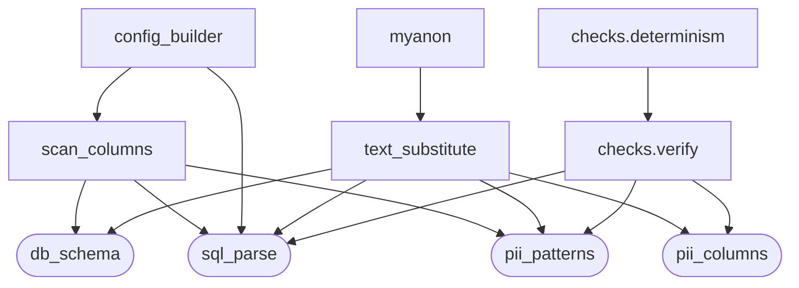
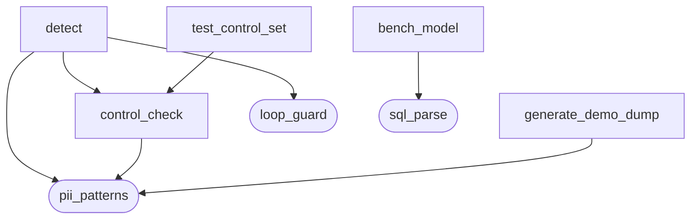
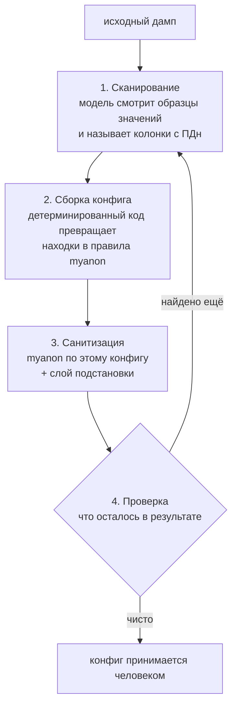

# Санитизация базы MySQL

Решение тестового задания: база с персональными данными на входе — та же база
без них на выходе, с сохранёнными связями, объёмом и разнообразием данных.

Документ описывает, что сделано и чем это подтверждено. Все числа получены
прогоном проверочных скриптов, а не оценкой на глаз.

---

## Текст задания

> На вход подаем бд — на выход получаем бд, но которая очищена от конф и
> персональных данных.

> Пусть подготовит и задеплоит решение для санитизации бд на mysql.
> Как проверять: продуктовая часть — смог продумать и логично объяснил
> выбранный формат решения; техническая — проресерчил опенсорс и доработал
> его; использовал ллм для логичных замен; внедрил сквозные замены; бд после
> санитизации сохранила все связи и объем и разнообразие данных.

### Ответы заказчика на уточняющие вопросы, 15.09

| Вопрос | Ответ |
|---|---|
| Какую базу брать | заказчик не присылает: публичная (chinook, sakila) или своя, обязательно с PII-полями и свободным текстом |
| Срок | 24 сентября |
| Что считать конфиденциальным | отдельного перечня нет, трактовка на исполнителе; чистятся обе категории |
| Переносимость | MySQL фиксирован, переносимость не нужна |
| Что значит «сдано» | репозиторий, поднимаемый одной командой, плюс README с обоснованием выбора |

Кроме ответов на вопросы, заказчик отдельно сказал три вещи: **рамку и
допущения принимает**, **исключения из объёма принимает**, и **критерий по
разнообразию данных зачтёт частично**. Первые два переводят допущения и
границы ниже из односторонних в согласованные. Третье принято и учтено —
см. «Границы решения».

### Что изменилось после первой сдачи 11.09

Цикл автонастройки замкнут: сборщик конфига написан, конфиг собран из находок
модели, прогон по нему выполнен. Детектор имён встроен в конвейер. Суммы
отнесены к конфиденциальным и обрабатываются. Проверяющий развязан с
проверяемым. Решение прогнано на чужой схеме — на публичной базе sakila,
и этот прогон нашёл в коде класс утечки, на своей базе не проявлявшийся.

---

## Что сделано — по каждому пункту проверки

| Пункт | Чем закрыт | Подтверждение |
|---|---|---|
| Формат решения | этот документ | — |
| Опенсорс и доработка | myanon выбран из пяти кандидатов, доработан вторым слоем | после одного лишь myanon в дампе остаётся 97 значений из 186 |
| Роль ЛЛМ | модель находит, детерминированный механизм заменяет | сканер на своей базе: 3 колонки принято, 14 отклонено; на чужой (sakila): 8 принято, 44 отклонено. Детектор: 10 из 10, 0 ложных |
| Сквозные замены | одно значение заменяется одинаково в колонке и в тексте | 186 пар, расхождений 0 |
| Связи и объём | замены сохраняют вид данных, строки не удаляются | 30/15/60/60 строк, разнообразие совпадает везде |

**Подробнее про роль модели.** Сканер определяет колонки с персональными
данными и через код настраивает myanon; детектор ищет имена в свободном
тексте. Относительно написанного руками конфига сканер добавил пропущенное
и убрал лишнее. Ноль ложных срабатываний получен на 13 отрицательных
примерах. Что из этого уже встроено в конвейер, а что нет — в разделе
«Состояние работ», без округлений.

---

## Как устроено решение

Вход и выход — база MySQL. Решение состоит из двух фаз: **настройка** — один
раз на новую базу, с участием человека, и **прогон** — сколько угодно раз,
без человека. Модель в прогоне не участвует, пока не включён поиск имён
в свободном тексте: он выключен по умолчанию и включается флагом
`DETECT_NAMES=1`.

<picture>
  <source media="(prefers-color-scheme: dark)" srcset="docs/assets/architecture-dark.png">
  
</picture>

Схема собрана из типизированного описания
[`docs/architecture.archify.json`](docs/architecture.archify.json) — её можно
пересобрать и проверить на пересечения линий и наложения подписей машинно, а не
глазами. Интерактивная версия с переключением между фазами —
`docs/architecture.html`.

Исходный дамп нужен обоим этапам: по паре «исходный / после этапа 1» второй
этап восстанавливает, чем myanon заменил каждое значение.

**Фаза прогона запускается одной командой и ручных шагов не требует.** Фаза
настройки требует одного: человек смотрит дифф конфига и принимает его.
Подробно — в разделе «Цикл автонастройки».

### Этап 1 — открытый инструмент

**[myanon](https://github.com/ppomes/myanon)** (лицензия Modified BSD): читает
дамп потоком, к рабочей базе не подключается, заменяет значения в колонках,
перечисленных в конфиге. Перечень не пишется руками — его определяет фаза
настройки. Одинаковое значение всегда получает одинаковую замену: это встроено
в механику myanon, а не настраивается.

Выбран из пяти кандидатов. Причины отсева проверялись по первоисточнику —
чтением кода и `git log`, а не по описанию на странице проекта:

| Кандидат | Почему не подошёл |
|---|---|
| [gdpr-dump](https://github.com/Smile-SA/gdpr-dump) | лицензия GPL-3.0 — копилефт, обязывает открывать производный код |
| [Greenmask](https://github.com/GreenmaskIO/greenmask) | поддержка MySQL в пререлизном состоянии — [эпик #222](https://github.com/GreenmaskIO/greenmask/issues/222) ещё не закрыт |
| [nxs-data-anonymizer](https://github.com/nixys/nxs-data-anonymizer) | разработка фактически остановлена: последний коммит 22.09.2025 |
| [Neosync](https://github.com/nucleuscloud/neosync) | репозиторий архивирован владельцем |
| [Datanymizer](https://github.com/datanymizer/datanymizer) | MySQL в README помечен как невыполненный пункт: `- [ ] MySQL or MariaDB (TODO)` |

Состояние кандидатов перепроверено 10.09.2026 запросами к API GitHub. Это
факты на дату: эпик Greenmask может закрыться, а разработка возобновиться.

Честная оговорка: у gdpr-dump сквозная замена тоже подтверждена кодом, и по
кириллице он сильнее — у него готовая русская локаль генератора из коробки.
Решающей оказалась лицензия. Если копилефт для вас приемлем, gdpr-dump —
достойная альтернатива, и выбор стоит пересмотреть.

### Этап 2 — доработка, ради которой всё и делалось

myanon применяет правило к значению поля целиком и внутрь строки не смотрит.
Телефон, заменённый в своей колонке, остаётся открытым в комментарии, где он
упомянут текстом.

**Замерено на действующем конфиге: после одного лишь этапа 1 в дампе остаётся
97 исходных значений из 186, и 32 комментария из 60 содержат персональные
данные открытым текстом.**

Число привязано к конкретному конфигу — тому, что запускается сегодня. С другим
перечнем колонок оно будет другим. Неизменно другое: сколько бы колонок ни
перечислили в конфиге, значения, упомянутые внутри свободного текста, myanon не
тронет никогда — он не смотрит внутрь строки. Дыра не в конфиге, а в границе
инструмента.

Настройкой это не закрывается: единственное, что можно сделать конфигом со
свободным текстом, — захешировать комментарий целиком, уничтожив сам текст.
Дыра принципиально требует доработки — это и есть «доработал опенсорс».

Доработка строит карту «исходное значение → его замена» из трёх источников и
делает один проход подстановки по всему дампу:

1. **Из колонок.** Пары «было → стало» восстанавливаются сопоставлением
   исходного и обработанного дампов по позиции строк. Внутренний алгоритм
   myanon не воспроизводится — замены берутся из его же вывода, поэтому
   обновление инструмента ничего не ломает.
2. **По формату.** Телефон, ИНН, СНИЛС, почта, найденные в тексте и ещё не
   попавшие в карту. Сюда попадают и реквизиты третьих лиц, которых нет ни в
   одной таблице, — курьера, подрядчика. С проверкой контрольных сумм:
   значение с неверной суммой не заменяется, потому что это не персональные
   данные.
3. **Имена в свободном тексте.** Единственный вид персональных данных, у
   которого нет ни строгого формата, ни источника в колонках. Здесь работает
   языковая модель.

### Как сквозная замена выглядит на самом деле

Одна запись из демо-набора, до и после. Это и есть то, чего myanon из коробки
не делает и ради чего понадобилась доработка:

```
customers.inn
  было : 386379402608
  стало: 562356013946

orders.comment у того же клиента
  было : ИНН клиента для документов: 386379402608.
  стало: ИНН клиента для документов: 562356013946.
```

Одно и то же новое значение по обе стороны границы «колонка / свободный текст».
Порождённый ИНН при этом валиден по обеим контрольным цифрам, то есть остаётся
ИНН, а не превращается в мусор.

---

## Из каких модулей состоит

Граф снят с кода разбором импортов на действующей раскладке, а не нарисован
по памяти.

**Конвейер — то, что участвует в санитизации.**



**Замер детектора — в санитизации не участвует.**



Скруглённые узлы — основания: своих зависимостей внутри решения у них нет.
`pii_patterns` и `sql_parse` показаны на обеих схемах — это одни и те же
модули. Ребро между схемами одно: `text_substitute` вызывает `detect`, но
только при `DETECT_NAMES=1`; без флага детектор в прогоне не участвует, и
первая схема описывает прогон целиком.

Модуль `names` и файл пула ФИО остались в репозитории, но их не импортирует
никто: пул убран из пути замены, узла `names` в графе больше нет.
`bench_model` на схемах не показан и лежит в `scripts/`, а не в пакете:
его никто не импортирует, а в пакете остаётся только то, что импортируют
другие модули — по этому же правилу там остался `control_check`.

| Модуль | Что делает |
|---|---|
| `sql_parse` | разбор INSERT, оба формата дампа |
| `db_schema` | разбор CREATE TABLE, ключевые колонки |
| `pii_patterns` | формат, контрольные суммы, порождение замен |
| `loop_guard` | предохранители цикла |
| `names` | пул ФИО, раздача хешем — в конвейере не участвует |
| `scan_columns` | модель называет колонки с ПДн |
| `text_substitute` | подстановка по всему дампу |
| `checks.verify` | восемь проверок результата |
| `checks.determinism` | тот же ключ — тот же результат |
| `control_check` | правило сравнения и проверка эталона |
| `detect` | детектор имён в свободном тексте |
| `generate_demo_dump` | демо-данные |
| `pii_columns` | общие данные: перечень персональных колонок и типы свободного текста |
| `config_builder` | сборка конфига myanon из находок сканера |
| `scripts/bench_model` | замер модели на демо-данных |

**Чего в графе нет намеренно.** Модуль `paths` — от него зависят девять модулей, но
он разрешает пути к данным и к частям конвейера отношения не имеет; семь
линий к нему сделали бы картинку нечитаемой. Он появился при переходе на
каталоги: до этого имена файлов данных разрешались относительно текущего
каталога, и перемещение модуля меняло поведение молча.

Оркестрация — не в Python: `scripts/sanitize.sh` запускает myanon и
`text_substitute`, `scripts/entrypoint.sh` замыкает цепочку от базы до базы
и зовёт проверки, `docker-compose.yml` поднимает всё вместе.

**`pii_patterns` — узел, от которого зависят шестеро.** Это намеренно: правило
«что распознаётся по формату, то и обрабатывается по формату» должно жить в
одном месте, иначе распознавание и порождение разойдутся. Один и тот же модуль
и находит значение, и порождает ему замену того же вида.

**`control_check` лежит в пакете, а не в `tests/`** — хотя по названию это
проверка. Его импортирует `detect`: правило сравнения найденного с размеченным
одно и то же и в замере, и в тесте. Разведи их — и замер начнёт мерить одним
правилом, а тест проверять другим. В `tests/` лежит тест поверх этого модуля.

**Проверяющий развязан с проверяемым.** Раньше `checks.verify` импортировал
из `text_substitute` и перечень колонок, и функцию построения карты замен — то
есть был частично построен на коде того, что проверяет: ошибка в построении
карты стала бы для проверки невидимой. Это не гипотетический класс, в этой
работе дважды случалось, что ложный результат давал инструмент проверки, а не
измеряемое.

Сделано: перечень колонок вынесен в `pii_columns` — модуль с одними данными,
от которого зависят обе стороны, а друг от друга они не зависят. Карту замен
проверка строит заново, сопоставлением дампов по позиции строк. Дублирование
здесь намеренное: смысл в том, чтобы ошибка одной реализации не была невидима
для другой. После развязки обе независимые реализации дают одно и то же —
186 пар, расхождений 0.

---

## Что заменяется и на что

| Вид данных | Кто обрабатывает | Чем заменяется | Что сохраняется |
|---|---|---|---|
| ФИО | myanon по конфигу | `texthash` | длина, признак заполненности |
| Адрес | myanon по конфигу | `texthash` | длина, признак заполненности |
| Телефон | слой подстановки, по формату | порождённый номер | формат `+7 9XX XXX-XX-XX` |
| ИНН (12 знаков) | слой подстановки, по формату | порождённый ИНН | обе контрольные цифры верны |
| СНИЛС | слой подстановки, по формату | порождённый СНИЛС | контрольное число верно |
| Почта | слой подстановки, по формату | порождённый адрес | домен целиком |
| Имя в свободном тексте | слой подстановки, по находке модели | буквенная строка | длина |
| Суммы (конфиденциальные) | myanon по конфигу | `inthash` | уникальность значений и связь «заказ ↔ платёж» |

Правило простое: **что распознаётся по формату — берёт слой подстановки, что
не распознаётся — идёт в конфиг myanon.** Граница проведена не по удобству, а
по доказуемости: у телефона, ИНН, СНИЛС и почты есть проверяемый формат, а у
имени и адреса его нет.

Из этого правила следует и разделение труда с моделью: сканер спрашивают
только про то, чего формат не берёт.

**Суммы — это трактовка исполнителя, а не требование задания.** Заказчик
сказал 15.09: отдельного перечня конфиденциальных данных нет, работать по
своей трактовке, чистить обе категории. Отнесены суммы заказов и платежей.
Проверено, что обработка не рвёт смысл базы: уникальных сумм заказов было 60
и осталось 60, платежей — 36 и 36, а совпадений «сумма платежа равна сумме
какого-то заказа» было 60 и осталось 60 — связь по значению между таблицами
выдержала. **Цена названа прямо: `inthash` работает с целыми, дробная часть
теряется** — `350033.02` превращается в `15688768`. Если копейки нужны, это
отдельная доработка, а не настройка.

**Имя в свободном тексте обрабатывается только при включённом детекторе.**
Флаг `DETECT_NAMES=1`. Выключено по умолчанию намеренно: прогон обязан
воспроизводиться на машине без модели и без сети, иначе проверка «тот же
ключ — тот же результат» перестаёт что-либо значить.

На демо-наборе детектор осмотрел 60 комментариев, нашёл 4 упоминания людей и
принял 0: все четверо уже покрыты заменой из колонок. Это не провал детектора,
а свойство демо-набора — все люди, упомянутые в комментариях, есть в таблице
клиентов. Случай «упомянут человек, которого нет ни в одной таблице» в наборе
не представлен, и добавлять его туда специально значило бы подгонять входные
данные под нужный вывод. Поэтому детектор замеряется на отдельном контрольном
наборе: 10 из 10 найдено, 0 ложных на 13 отрицательных примерах.

**Конфиг, который запускается сегодня, собран автонастройкой, а не руками.**
Сканер назвал `full_name` в обеих таблицах и `address`, сборщик добавил на них
правила; написанные руками правила на почту остались нетронутыми — внутри
цикла правила только добавляются. Почту сканер не предлагает и правильно
делает: она закрывается форматным слоем доказуемо и без правила, а домен при
этом сохраняется так же, как у `emailhash` — `customer1@example-mail.ru`
превращается в `nqqoxnhftw@example-mail.ru`.

Цена нарушения этого правила проверена на себе: в ранней версии телефон стоял
и в конфиге, и в форматном слое — в колонке он превращался в буквенный мусор,
а в тексте в правильный номер. Один вид данных, два разных результата в одной
базе.

**Не заменяется по решению исполнителя:** город, отдел, номенклатура, даты.
Сами по себе они человека не идентифицируют, а их замена разрушила бы
аналитическую ценность базы.

**Суммы отнесены к конфиденциальным данным** — разбор и замеры выше.

**ИНН из 10 знаков не распознаётся намеренно.** Он принадлежит юридическому
лицу, а не человеку, и у него одна контрольная цифра: случайный десятизначный
номер заказа проходит проверку примерно в одном случае из одиннадцати. Цена
ложных срабатываний выше пользы.

---

## Ключ замен

Замены определяются ключом, который передаётся через окружение и не хранится
ни в репозитории, ни в конфиге, ни в образе: временный конфиг создаётся с
правами 600 и удаляется при любом завершении, включая прерывание.

Оба свойства проверены машинно:

- один и тот же ключ даёт один и тот же результат — прогоны воспроизводимы;
- другой ключ даёт другие замены — по двум выгрузкам с разными ключами нельзя
  сопоставить записи.

Ключ — единственное, что связывает исходное значение с заменой. Замены строятся
на HMAC-SHA256.

---

## Роль языковой модели

**Модель находит, детерминированный механизм заменяет.** Это разделение
получено замером, а не выбрано из вкуса.

### Почему модель не порождает замены

Проверялись оба варианта.

Если модель придумывает замену на каждое уникальное значение независимыми
запросами, она тяготеет к частотным именам: **20 исходных ФИО с 10 разными
фамилиями превратились в 7 ФИО с 4 фамилиями**, два разных клиента слились в
одного. Это ломает требование сохранить разнообразие.

Один запрос с просьбой выдать 30 разных ФИО даёт 30 разных ФИО, среди них 29
разных фамилий, — дело не в неспособности модели. Дело в том, что разнообразие тогда держится на её
поведении, а не гарантируется построением. При раздаче хешем оно гарантировано.

Дополнительно: правдоподобная замена — это синтетические персональные данные,
неотличимые от настоящих. Очищенную базу нельзя отличить от боевой по
содержимому, а по этому признаку принимают решения о том, где её хранить и
кому показывать.

### Что модель делает

Ищет имена людей в свободном тексте. Телефон, ИНН, СНИЛС и почту берёт
форматный слой с проверкой контрольных сумм, где полнота доказуема
арифметикой; менять доказуемое на вероятное там незачем.

Размер дыры измерен: детерминированный слой находит **8 из 8** значений
строгого формата и **0 из 10** имён в свободном тексте.

### Замер детектора

Контрольный размеченный набор: 27 записей, 14 с персональными данными, 13 без.
Тексты написаны вручную и не порождены генератором демо-данных; проверка себя
собой исключена машинно — ни одно значение набора и ни один фрагмент из пяти
подряд идущих слов не встречаются в демо-данных.

Модель `qwen3:14b` работает локально. Внешние сервисы не используются, данные
машину не покидают.

```
Имён в эталоне : 10
Найдено верно  : 10
Пропущено      : 0
Ложных         : 0
Полнота        : 1.00
Точность       : 1.00   (до фильтра вложенных находок: 0.91)
Время          : 49 с на 27 записей
```

Пять из тринадцати отрицательных примеров подобраны именно против детектора
имён: «ООО «Ковалёв и партнёры»», «Кировский завод», «улица Академика
Королёва», «Ударил мороз», «Надежда на отгрузку». Ещё четыре бьют по форматным
распознавателям: двенадцать цифр с неверной контрольной суммой, ИНН
юридического лица, телефон 8-800, номер в форме СНИЛС с неверной суммой.
Ложных срабатываний ни на одном.

Про разницу 0.91 и 1.00: единственная сырая ошибка — фрагмент `v.pankratov`,
опознанный внутри адреса почты. Модель не ошиблась, это действительно фамилия,
но адрес заменяется целиком, и отдельное правило на его кусок защиты не
добавляет, зато создаёт вторую замену внутри одного значения. Такие находки
отбрасываются детерминированным фильтром. Публикуются оба числа.

**Как читать эти числа.** Полнота 1.00 на десяти примерах означает «ни одного
промаха на десяти», а не «единица»: один промах стоил бы 0.10. Набор из 27
записей не доказывает полноту на произвольных данных и не может её доказать —
эталона для незнакомых данных не существует.

### Цикл автонастройки — как модель участвует в настройке

Перечень обрабатываемых колонок не пишется руками. Его определяет цикл:



**Модель не настраивает myanon.** Она возвращает типизированный список находок:
таблица, колонка, вид данных. Конфиг из него собирает детерминированный код.
Вывод модели не становится исполняемым — она не может ни удалить существующее
правило, ни сломать синтаксис, ни предложить действие вне белого списка.
Внутри цикла правила только добавляются.

**Модель спрашивается не обо всём.** Телефон, ИНН, СНИЛС и почту находит
форматный слой с проверкой контрольных сумм — там полнота доказуема
арифметикой. Отдавать эти колонки модели значит менять доказуемое на
вероятное. Сканер получает только то, чего формат не берёт.

#### Предохранители — и каждый закрывает конкретный способ всё сломать

| Предохранитель | Что было бы без него |
|---|---|
| Ключевые колонки не показываются модели и отклоняются после ответа | хеширование внешнего ключа разрушило бы связи между таблицами — ровно то, что задание требует сохранить |
| Колонки свободного текста (`text`, `blob`, `json`) правил не получают | правило применяется к значению целиком, то есть комментарий был бы захеширован полностью: формально замена, по сути уничтожение данных |
| Белый список видов данных | модель не может предложить действие, которого нет в списке |
| Одна колонка — одно правило | два правила myanon не примет, а молча взятое первое спрятало бы противоречие в ответе модели |
| Порог живости перед стартом | цикл останавливается, когда находок нет; ровно тот же сигнал даёт отвалившаяся модель, поэтому перед стартом она обязана показать минимум на контрольном наборе |
| Находка засчитывается, только если есть во входном дампе | иначе цикл гонялся бы за собственными заменами |
| Потолок итераций | не сошлось — падаем с отчётом, а не крутимся |

Последние два предохранителя и первые четыре — не предположения о том, что
может пойти не так. Первые два найдены первым же прогоном сканера: модель
предложила колонку свободного текста, и предложила её трижды с тремя разными
видами данных.

#### Что уже проверено

Сканер, запущенный на демо-базе, вернул:

```
customers.full_name -> имя
customers.address   -> адрес
employees.full_name -> имя

отброшено детерминированными фильтрами: 14
  7 ключевых колонок, 5 покрытых форматным слоем,
  1 свободный текст, 1 не предложена моделью
```

**Сравнение с ручным конфигом — и оно интереснее совпадения.** Руками в конфиге
прописаны `customers.email`, `customers.address`, `employees.email`. Совпадает
одна строка из трёх, и оба расхождения объяснимы:

| Расхождение | Кто прав |
|---|---|
| Сканер добавил `full_name` в обеих таблицах | сканер. В ручном конфиге ФИО не было, потому что имена обрабатывались в обход myanon — тем самым механизмом, от которого решено отказаться. Сканер назвал колонку, которую ручная настройка пропустила |
| Сканер убрал `email` в обеих таблицах | сканер. Почта распознаётся по формату, а значит закрывается доказуемо и без правила. Домен при этом сохраняется так же, как у `emailhash` |

То есть автонастройка не повторила ручной конфиг, а поправила его в обе
стороны. Это сильнее совпадения: совпадение говорило бы лишь, что модель
угадала уже известный ответ.

**Сквозной прогон по автонастроенному конфигу выполнен — и сразу нашёл
дефект.** Сборщик добавил правило `texthash` на `full_name`, и оно столкнулось
с прежним механизмом замены ФИО: в колонке стоял хеш от myanon, а внутри
текста — правдоподобное имя из пула. Проверка сквозной замены упала:
3 расхождения из 186 пар, с примерами.

Дефект существовал и до цикла, но проявиться не мог: пока `full_name` не было
в конфиге, два механизма не пересекались. Пул убран из пути замены, ФИО
обрабатывает myanon той же механикой, что и адрес. После правки все проверки
«норма», расхождений 0.

Это и есть ответ на вопрос, зачем цикл нужен, если конфиг можно написать
руками: руками написанный конфиг был неполон, а его неполнота маскировала
конфликт двух механизмов.

#### Почему цикл вынесен из рабочего прогона

Схема базы между выгрузками не меняется, поэтому конфиг определяется один раз,
человек принимает дифф, дальше он лежит файлом. Если бы конфиг рождался
моделью на каждом запуске, результат зависел бы от её сэмплирования, и
проверка «тот же ключ — тот же результат» перестала бы выполняться.

Это относится к настройке. Поиск имён в свободном тексте — другая роль,
и она из прогона не выносится, но включается флагом: по умолчанию выключена,
чтобы прогон оставался воспроизводимым на машине без модели.

### Вторая роль модели — поиск имён в свободном тексте

Комментарии в каждой выгрузке новые, кэшировать нечего, поэтому здесь модель
вызывается на каждом прогоне — и это становится требованием к промышленной
установке. Порядка 10 ГБ оперативной памяти на машине с моделью; эндпоинт
настраиваемый (`LLM_ENDPOINT`), поэтому модель может стоять на отдельной
машине внутри контура.

Отсюда и флаг `DETECT_NAMES`. Требование «прогон воспроизводится где угодно»
и требование «имена в тексте найдены» несовместимы: первое запрещает модель
в прогоне, второе её требует. Вместо того чтобы выбрать одно молча, выбор
вынесен наружу. По умолчанию выключено — безопасный режим по умолчанию,
небезопасный включается явно.

Замерено на демо-наборе: осмотрено 60 комментариев, сырых находок 4, принято 0
— все четверо уже покрыты заменой из колонок. Оба детерминированных фильтра
цикла при этом отработали: ни одна находка не была отброшена как отсутствующая
во входном дампе или вложенная в уже покрытое значение.

Требование воспроизводимости для роли 2 выполняется иначе: модель вызывается с
нулевой температурой, а замену найденному назначает всё тот же детерминированный
хеш от ключа.

---

## Как проверяется результат

Проверка машинная и не требует базы: сравниваются исходный и очищенный дампы.
Вовосемь проверок. Вывод последнего сквозного прогона:

```
Персональные данные из колонок в результате        0 из 186                       норма
Данные строгого формата в результате               0 из 139                       норма
Число строк по таблицам      customers:30 / employees:15 / orders:60 / payments:60  норма
Разнообразие значений                              совпадает везде                норма
Сквозная замена: число вхождений «было» = «стало»  пар проверено 186, расхождений 0  норма
Одно значение не получило двух замен               норма                          норма
Ссылочная целостность: внешние ключи указывают на существующие строки  связей 4, осиротевших 0  норма
Контрольные суммы порождённых ИНН и СНИЛС          проверено 139, неверных 0      норма

Все проверки пройдены.
```

186 — все уникальные персональные значения из колонок исходной базы, 139 — все
значения строгого формата, найденные в исходном дампе. Ноль означает «ни одно
из них не встречается в результате», а не «проверено ноль штук».

Отдельно проверяется детерминированность: тот же ключ — результат тот же;
другой ключ — результат другой.

**Пустая проверка считается отказом, а не успехом.** Каждая проверка,
опирающаяся на разбор данных, падает, если разобрано ноль элементов. Это не
теоретическая предосторожность: на одном из прогонов разборщик не понял вывод
`mysqldump`, и отчёт напечатал «0 из 0 — норма» по трём строкам и «все проверки
пройдены» внизу. Защита добавлена и отдельно проверена прогоном на заведомо
неразбираемом дампе.

**Проверка на нескольких ключах.** Полный набор прогонялся на четырёх разных
ключах, включая ключ со слешами. Замер на одном ключе подтверждает работу
этого ключа, а не механизма: дефект, при котором замена совпадала с реальным
значением из той же базы, существовал незаметно и проявился только при смене
ключа.

---

## Прогон на чужой схеме — sakila

Заказчик назвал sakila и chinook как допустимые базы. Основной осталась своя:
ни в sakila, ни в chinook нет колонки, где персональные данные могли бы
встретиться внутри произвольного текста — проверено по документации MySQL
и по DDL chinook. В sakila свободный текст один, `film.description`, это
пересказ сюжета; в chinook колонок `TEXT` нет вообще.

Но sakila годится для другого и более важного: **проверить, что сканер
работает на схеме, которую никто ему не подсказывал.** База загружена в MySQL
и выгружена тем же способом, каким выгружает само решение: 16 таблиц,
16 044 платежа, 16 044 проката.

Сканер назвал 8 колонок и отклонил 44 детерминированными фильтрами:

```
actor.first_name    -> имя      customer.first_name -> имя
actor.last_name     -> имя      customer.last_name  -> имя
staff.first_name    -> имя      staff.last_name     -> имя
address.address     -> адрес    film_text.title     -> имя   <- ложное
```

**Прогон нашёл в нашем коде класс утечки, который на своей базе не
проявлялся.** Сначала сканер вернул 6 колонок: `actor.last_name` и
`customer.last_name` были отброшены как «ключевые». В sakila они под
индексом — `KEY idx_actor_last_name (last_name)`, — но обычный индекс не
задаёт ни связи, ни тождества, и хеширование такой колонки ничего не ломает.
Прежний разбор считал ключевой любую колонку под любым ключом, то есть
**исключал фамилию из санитизации всякий раз, когда она проиндексирована** —
а на реальной схеме фамилия под индексом дело обычное. Исправлено: ключевыми
считаются только колонки первичного, уникального и внешнего ключа. После
правки фамилии находятся, на своей базе перечень ключевых колонок не
изменился, восемь проверок по-прежнему «норма».

**Вторая находка — про формат дампа.** sakila в своём виде нашим разбором не
читается: она распространяется без обратных кавычек и без перечня колонок
в `INSERT`. Решение работает с выводом `mysqldump --complete-insert
--skip-extended-insert`. Отдельно: в sakila есть `staff.picture` типа `BLOB`,
и без `--hex-blob` разбор падает на не-UTF-8 — флаг добавлен в `entrypoint.sh`.

**Ложное срабатывание названо, а не спрятано:** `film_text.title` — это
название фильма, а не имя человека. Именно поэтому конфиг принимает человек:
дифф показывает предложенное правило до того, как оно что-то испортит.
Автоопределение сокращает ручной проход по схеме, но не отменяет его.

---

## Границы решения — чего оно не делает

Раздел существен: без него предыдущий читается как гарантия, которой нет.
Заявленные исключения из объёма заказчик 15.09 принял.

- **Полнота на незнакомой схеме не гарантируется.** Обрабатываемые колонки
  перечисляются в конфиге, полноту перечня проверяет человек, сверяя его со
  схемой. Автоопределение эту работу сокращает, но не отменяет: оно находит
  только то, что распознаёт, и колонка с внутренним табельным номером или
  отраслевым кодом останется незамеченной.
- **Разнообразие сохраняется как число различных значений, но не как их
  распределение.** Проверка подтверждает: сколько уникальных значений было,
  столько и осталось, а связь по значению между таблицами уцелела. Чего замена
  не сохраняет — форму распределения: длины выравниваются, частоты сглаживаются,
  порождённый ИНН валиден, но не принадлежит реальному региону. Это следствие
  выбранного баланса: необратимость против правдоподобия. Правдоподобная замена
  сохранила бы распределение, но породила бы синтетические персональные данные,
  неотличимые от настоящих. Заказчик, принимая рамку, предупредил, что зачтёт
  этот критерий частично — предупреждение принято, выбор сделан осознанно и
  может быть пересмотрен, если очищенную базу читают люди (открытый вопрос 4).
- **Замена необратима без ключа, но не стойка к подбору по словарю.** При
  известном ключе и коротком пространстве значений соответствие
  восстанавливается перебором. Защита строится на секретности ключа.
- **Суммы обрабатываются, цены — нет.** Суммы заказов и платежей отнесены
  к конфиденциальным по трактовке исполнителя; прайс-листов в демо-базе нет,
  поэтому механизм на них не проверялся. Дробная часть суммы теряется.
- **Формат входного дампа задан.** Решение читает вывод `mysqldump` с
  `--complete-insert`, `--skip-extended-insert` и `--hex-blob`. Дамп без
  перечня колонок в `INSERT` — например, sakila в том виде, в каком её
  распространяют, — не разбирается. Конвейер выгружает базу сам и этими
  флагами пользуется, так что для заявленного входа «на вход подаём бд»
  ограничение не действует.
- **Поиск имён в свободном тексте требует модели на каждом прогоне** — не для
  настройки, а для самого поиска. Поэтому он выключен по умолчанию и
  включается `DETECT_NAMES=1`: прогон без флага воспроизводится на машине без
  модели и без сети, с флагом — нет. Цена выключения: имя человека, которого
  нет ни в одной таблице, останется в комментарии открытым.
- **Ссылочная целостность проверяется по дампу, а не запросом к базе.**
  Проверка читает объявленные в схеме внешние ключи и убеждается, что каждое
  значение указывает на существующую строку родительской таблицы. Запросом это
  не подтверждается намеренно: дамп загружается с `FOREIGN_KEY_CHECKS=0`,
  поэтому успешная загрузка ничего не доказывает — осиротевшая строка прошла бы
  молча. Граница у проверки своя: связь, которая существует по смыслу, но не
  объявлена внешним ключом, ей не видна, и на схеме без объявленных ключей
  проверка сообщит «связей проверено 0» и упадёт, как и всякая пустая проверка.

---

## Демо-данные

Заказчик базу не выдавал, поэтому демо-набор подготовлен исполнителем:
30 клиентов, 15 сотрудников, 60 заказов, 60 платежей. Кириллица, персональные
данные и в колонках, и внутри свободного текста комментариев, включая
реквизиты третьих лиц, которых нет ни в одной таблице.

Генератор воспроизводит дамп байт в байт, поэтому проверки повторяемы.

**Все персональные данные в демо-наборе вымышлены и порождены алгоритмически.**
Контрольные суммы ИНН и СНИЛС верны намеренно — иначе распознавание
проверялось бы на значениях, которые в жизни не встречаются. Любое совпадение
порождённого номера с настоящим случайно: имена, адреса и номера в наборе
между собой не согласованы и взяты из независимых генераторов.

---

## Состояние работ

| Компонент | Состояние |
|---|---|
| Сквозной прогон база → база в контейнере | работает; проверено на чистом клоне репозитория: `git clone` в пустой каталог, `docker compose up --build`, код возврата 0 |
| Замена в колонках | работает, проверено |
| Подстановка в свободный текст | работает, проверено |
| Распознавание по формату с контрольными суммами | работает, проверено |
| Восемь проверок результата и детерминированность | работают, проверены; каждая падает на пустых данных |
| Контрольный набор и замер детектора | готовы, проверены |
| Разбор схемы, поиск ключевых колонок | работает, проверен на трёх схемах: генератор, `mysqldump` демо-базы, `mysqldump` sakila. Ключевыми считаются только колонки первичного, уникального и внешнего ключа |
| Сканер колонок (шаг 1 цикла) | **работает**: на демо-базе назвал 3 колонки, 14 отклонил фильтрами |
| Предохранители цикла | реализованы, проверены отдельно |
| Сборка конфига из находок (шаг 2) | **работает**: собирает конфиг из отчёта сканера, правила только добавляются, вид сверяется с белым списком |
| Замыкание цикла (шаги 3–4) | один виток пройден целиком: сканер → сборщик → прогон → восемь проверок. Автоматического повторения витков нет, повторный запуск делается руками |
| Детектор имён в свободном тексте | **встроен**, включается `DETECT_NAMES=1`; по умолчанию выключен |
| Замена ФИО | **закрыта**: обрабатывается myanon по конфигу, как и адрес; пул правдоподобных имён из пути замены убран |
| Прогон на чужой схеме | проверен на sakila: 8 колонок найдено, 44 отклонено, 1 ложное срабатывание |
| Обработка сумм | **включена**: `orders.amount` и `payments.amount` обрабатываются `inthash`. Ответ от 15.09 — перечня нет, трактовка на исполнителе, чистятся обе категории |

**Как закрылось переходное состояние замены ФИО.** Раньше ФИО заменялись
правдоподобными вымышленными именами из пула, порождённого моделью заранее.
От этого варианта решено отказаться: правдоподобная замена создаёт
синтетические персональные данные, неотличимые от настоящих.

Убрать его заставил первый же прогон по автонастроенному конфигу. Сканер
назвал `full_name` колонкой с персональными данными, сборщик добавил на неё
правило `texthash`, и два механизма столкнулись: в колонке стоял хеш от
myanon, а внутри текста — имя из пула. Проверка сквозной замены упала —
3 расхождения из 186 пар, с примерами. Пул убран из пути замены, ФИО
обрабатывает myanon той же механикой, что и адрес. После правки все проверки
«норма», расхождений 0.

Модуль `names` и файл пула остались в репозитории, но в конвейере не
участвуют.

---

## Открытые вопросы к заказчику

1. ~~**Схема входной базы известна заранее или решение должно определять
   персональные данные само?**~~ Частично закрыт 15.09: базу собирает
   исполнитель, значит её схему он знает. Про чужую схему прямого ответа нет.
2. ~~**Что относится к конфиденциальным данным помимо персональных?**~~
   Закрыт 15.09: отдельного перечня нет, трактовка на исполнителе, чистятся
   обе категории.
3. **Допустим ли внешний API языковой модели или обработка строго локальная?**
   Сейчас реализовано локально, внешних вызовов нет.
4. **Очищенную базу читают люди или она вход для машинной обработки?** От этого
   зависит, должны ли замены быть правдоподобными или достаточно нейтрального
   значения того же вида.
5. ~~**В каком виде принимается результат?**~~ Закрыт 15.09: репозиторий,
   поднимаемый одной командой, плюс README с обоснованием выбора.
6. **Допустима ли зависимость промышленного прогона от языковой модели?**
   Поиск имён в свободном тексте требует вызова модели на каждой выгрузке.

---

## Допущения исполнителя

Приняты за отсутствием указаний в задании и **подтверждены заказчиком 15.09**
(«рамку и допущения принимаем»). Любое может быть отменено.

- Суррогатные числовые ключи (`id`) персональными данными не считаются и не
  заменяются: их замена разрушила бы связи между таблицами.
- Город, отдел, номенклатура, даты персональными данными не считаются.
- Десятизначный ИНН относится к организации и в персональные данные не входит.
- Docker выбран как способ выполнить требование «задеплоит».
- Демо-набор подготовлен исполнителем, поскольку база не выдавалась.

---

## Как запустить

```
git clone https://github.com/Andrey-Ostapenko/rusal-sanitizer
cd rusal-sanitizer
SANITIZE_SECRET='ваш-ключ' docker compose up --build
```

Одна команда поднимает MySQL, готовит исходную базу, выгружает её,
санитизирует, загружает результат во вторую базу и печатает восемь проверок.
Ставить на машину ничего не нужно: myanon собирается внутри образа из
исходников по закреплённому коммиту.

После прогона обе базы остаются рядом для сравнения — `sanitizer_demo`
исходная, `sanitizer_final` очищенная, — а дампы «до» и «после» лежат
в каталоге `out/`.

Поиск имён в свободном тексте выключен по умолчанию. Включается так:

```
DETECT_NAMES=1 \
LLM_ENDPOINT=http://host.docker.internal:12434/engines/v1/chat/completions \
SANITIZE_SECRET='ваш-ключ' docker compose up --build
```

С флагом прогон вызывает языковую модель на каждом значении свободного текста
и перестаёт воспроизводиться на машине без модели. Без флага — воспроизводится.

Настроить конфиг по новой базе (фаза настройки, требует модели):

```
PYTHONPATH=src python3 -m sanitizer.scan_columns дамп.sql
PYTHONPATH=src python3 -m sanitizer.config_builder scan_report.json дамп.sql
git diff config/myanon.conf.template    # дифф смотрит человек
```

Ключ замен передаётся только переменной окружения и никуда не записывается.
Демонстрационный ключ `demo-key-not-for-production` опубликован намеренно:
с ним пара «до/после» воспроизводится побайтово. Для реальных данных нужен
свой ключ, и в репозитории ему места нет.

Раскладка:

```
src/sanitizer/         конвейер и модули цикла автонастройки
src/sanitizer/checks/  восемь проверок и детерминированность — поставляемая часть
scripts/               оркестрация: sanitize.sh, entrypoint.sh, генератор демо-данных
config/                шаблон конфига myanon
data/                  демо-дамп и эталонный набор из 27 размеченных записей
tests/                 тест пригодности эталонного набора
docs/                  схема архитектуры
```

Проверено не на словах, и проверено на текущем состоянии: репозиторий
склонирован с GitHub в пустой каталог и собран с нуля — `docker compose up
--build`, код возврата 0, восемь проверок «норма» с ненулевыми числами,
детерминированность подтверждена, оба контейнера завершились кодом 0.

---

## Использованное открытое программное обеспечение

**[myanon](https://github.com/ppomes/myanon)** — анонимизатор дампов MySQL,
автор Pierre Pomes.

| | |
|---|---|
| Репозиторий | https://github.com/ppomes/myanon |
| Использованное состояние | [коммит `5eaafb18`](https://github.com/ppomes/myanon/tree/5eaafb182cbdc58c36677dff512ee956317677c1) от 04.09.2026 |
| Лицензия | [Modified BSD](https://github.com/ppomes/myanon/blob/5eaafb182cbdc58c36677dff512ee956317677c1/LICENSE.md) |

Ссылка на коммит ведёт на то самое состояние кода, на котором получены все
числа выше, — не на текущую ветку, которая с тех пор могла измениться.

Уведомление об авторских правах в лицензии охватывает трёх правообладателей:
Pierre Pomes (сам myanon), Troy D. Hanson (встроенный `uthash`) и Olivier Gay
(встроенная реализация SHA-2). Полный текст — по ссылке выше.

Исходники автора не изменялись: доработка сделана отдельным слоем поверх вывода
myanon и в его код не вмешивается.
