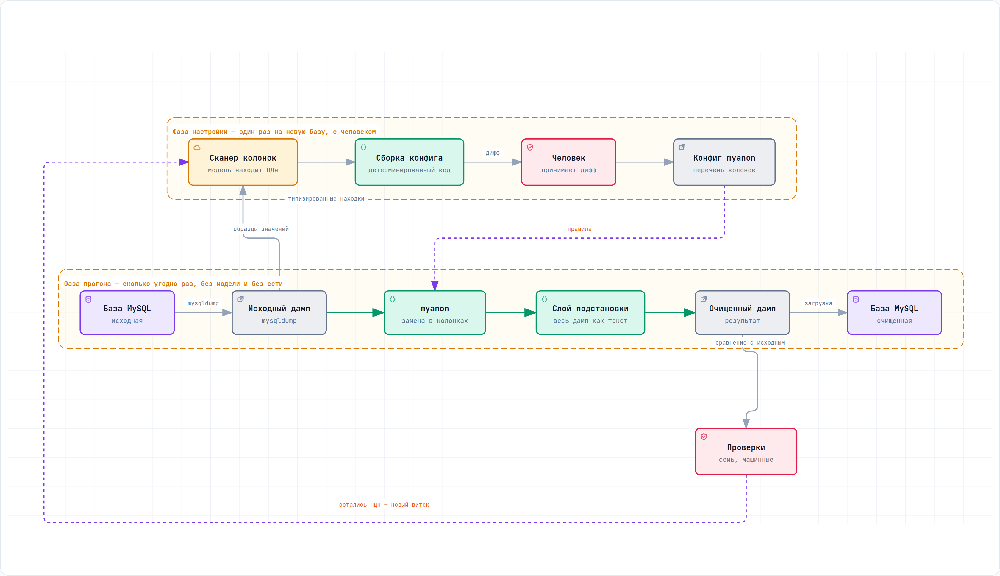
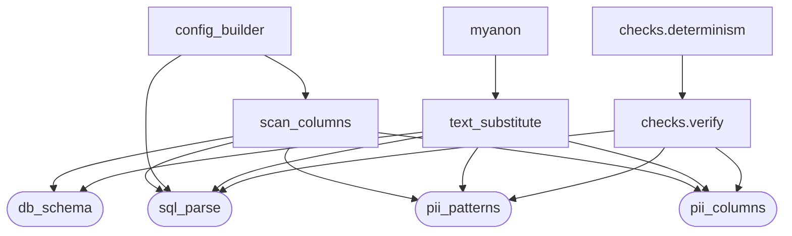
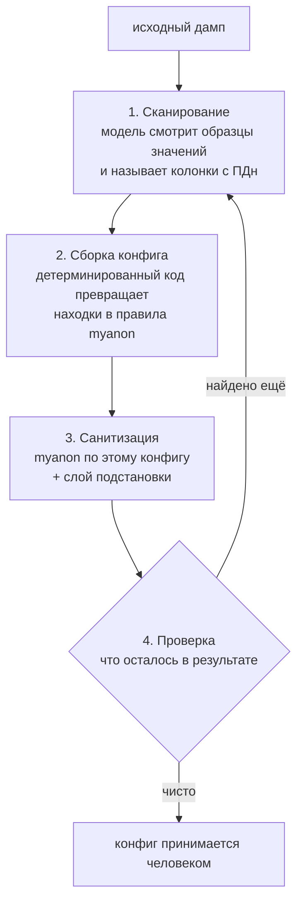

# Санитизация базы MySQL

Решение тестового задания: база с персональными данными на входе — та же база
без них на выходе, с сохранёнными связями, объёмом и разнообразием данных.

Документ описывает, что сделано и чем это подтверждено. Все числа получены
прогоном проверочных скриптов, а не оценкой на глаз.

## Коротко: где что смотреть

Документ длинный, потому что каждое решение подпёрто замером. Если читать
целиком некогда — вот карта по вашим же критериям проверки.

| Критерий из задания | Где смотреть | Чем подтверждено |
|---|---|---|
| Продумал и объяснил формат решения | «Как устроено решение», «Что заменяется и на что» | две фазы, граница слоёв по доказуемости |
| Проресерчил опенсорс и доработал | «Этап 1», «Этап 2» | пять кандидатов с причинами отсева по коду и `git log`; myanon на закреплённом коммите |
| Использовал ЛЛМ для логичных замен | «Роль языковой модели» | модель ищет, детерминированный хеш заменяет — выбор сделан по замеру, не по вкусу. **Это спорное решение, и его стоит обсудить** |
| Внедрил сквозные замены | «Как сквозная замена выглядит на самом деле» | 186 пар, 0 расхождений; карта для проверки строится независимо от кода замены |
| Связи, объём, разнообразие | «Как проверяется результат» | восемь машинных проверок, все с ненулевыми числами |

Запустить — одна команда, и вот она:

```
git clone https://github.com/Andrey-Ostapenko/rusal-sanitizer
cd rusal-sanitizer
SANITIZE_SECRET='ваш-ключ' docker compose up --build
```

Она сначала прогоняет тесты — включая сверку чисел этого документа с кодом и
с сохранёнными отчётами, — потом поднимает MySQL, готовит исходную базу,
выгружает, санитизирует, загружает результат во вторую базу и печатает восемь
проверок. Подробности и включение
поиска имён в тексте — раздел «Как запустить».

Что решение **не** делает — раздел «Границы решения», он написан до того, как
вы это спросите. Сохранённые отчёты замеров — каталог `measurements/`.

Если этот репозиторий открыл не человек, а агент, его файл —
[`AGENTS.md`](AGENTS.md) в корне: команды запуска, правила, которых здесь
придерживаются, и чего делать нельзя. Соглашение выбрано по потребителю:
`AGENTS.md` читают агенты-кодировщики из ближайшего файла в дереве
репозитория, тогда как `llms.txt` — соглашение для сайтов и путей URL,
которое в клонированном репозитории никто не читает.

Самое честное место документа — «Границы решения». Самое спорное — роль
модели: заказчик просил «ллм для логичных замен», а здесь модель ничего не
придумывает. Причина замерена и изложена, но это ровно тот вопрос, который
стоит задать на разборе.

---

## Текст задания

> На вход подаем бд — на выход получаем бд, но которая очищена от конф и
> персональных данных.

> Пусть подготовит и задеплоит решение для санитизации бд на mysql.
> Как проверять: продуктовая часть — смог продумать и логично объяснил
> выбранный формат решения; техническая — проресерчил опенсорс и доработал
> его; использовал ллм для логичных замен; внедрил сквозные замены; бд после
> санитизации сохранила все связи и объем и разнообразие данных.

### Ответы заказчика на уточняющие вопросы, 15.09

| Вопрос | Ответ |
|---|---|
| Какую базу брать | заказчик не присылает: публичная (chinook, sakila) или своя, обязательно с PII-полями и свободным текстом |
| Срок | 24 сентября |
| Что считать конфиденциальным | отдельного перечня нет, трактовка на исполнителе; чистятся обе категории |
| Переносимость | MySQL фиксирован, переносимость не нужна |
| Что значит «сдано» | репозиторий, поднимаемый одной командой, плюс README с обоснованием выбора |

Кроме ответов на вопросы, заказчик отдельно сказал три вещи: **рамку и
допущения принимает**, **исключения из объёма принимает**, и **критерий по
разнообразию данных зачтёт частично**. Первые два переводят допущения и
границы ниже из односторонних в согласованные. Третье принято и учтено —
см. «Границы решения».

### Что изменилось после первой сдачи 11.09

Цикл автонастройки замкнут: сборщик конфига написан, конфиг собран из находок
модели, прогон по нему выполнен. Детектор имён встроен в конвейер. Суммы
отнесены к конфиденциальным и обрабатываются. Проверяющий развязан с
проверяемым. Решение прогнано на чужой схеме — на публичной базе sakila,
и этот прогон нашёл в коде класс утечки, на своей базе не проявлявшийся.

---

## Что сделано — по каждому пункту проверки

| Пункт | Чем закрыт | Подтверждение |
|---|---|---|
| Формат решения | этот документ | — |
| Опенсорс и доработка | myanon выбран из пяти кандидатов, доработан вторым слоем | после одного лишь myanon в дампе остаётся 97 значений из 186 |
| Роль ЛЛМ | модель находит, детерминированный механизм заменяет | сканер на своей базе: 3 колонки принято, 14 отклонено; на чужой (sakila): 9 принято, 44 отклонено. Детектор: 10 из 10, 0 ложных |
| Сквозные замены | одно значение заменяется одинаково в колонке и в тексте | 186 пар, расхождений 0 |
| Связи и объём | замены сохраняют вид данных, строки не удаляются | 30/15/60/60 строк, разнообразие совпадает везде |

**Подробнее про роль модели.** Сканер определяет колонки с персональными
данными и через код настраивает myanon; детектор ищет имена в свободном
тексте. Относительно написанного руками конфига сканер добавил пропущенное
и убрал лишнее. Ноль ложных срабатываний получен на 13 отрицательных
примерах. Что из этого уже встроено в конвейер, а что нет — в разделе
«Состояние работ», без округлений.

---

## Как устроено решение

Вход и выход — база MySQL. Решение состоит из двух фаз: **настройка** — один
раз на новую базу, с участием человека, и **прогон** — сколько угодно раз,
без человека. Модель в прогоне не участвует, пока не включён поиск имён
в свободном тексте: он выключен по умолчанию и включается флагом
`DETECT_NAMES=1`.

<picture>
  <source media="(prefers-color-scheme: dark)" srcset="docs/assets/architecture-dark.png">
  
</picture>

Схема собрана из типизированного описания
[`docs/architecture.archify.json`](docs/architecture.archify.json) — её можно
пересобрать и проверить на пересечения линий и наложения подписей машинно, а не
глазами. Интерактивная версия с переключением между фазами —
`docs/architecture.html`.

Исходный дамп нужен обоим этапам: по паре «исходный / после этапа 1» второй
этап восстанавливает, чем myanon заменил каждое значение.

**Фаза прогона запускается одной командой и ручных шагов не требует.** Фаза
настройки требует одного: человек смотрит дифф конфига и принимает его.
Подробно — в разделе «Цикл автонастройки».

### Этап 1 — открытый инструмент

**[myanon](https://github.com/ppomes/myanon)** (лицензия Modified BSD): читает
дамп потоком, к рабочей базе не подключается, заменяет значения в колонках,
перечисленных в конфиге. Перечень не пишется руками — его определяет фаза
настройки. Одинаковое значение всегда получает одинаковую замену: это встроено
в механику myanon, а не настраивается.

Выбран из пяти кандидатов. Причины отсева проверялись по первоисточнику —
чтением кода и `git log`, а не по описанию на странице проекта:

| Кандидат | Почему не подошёл |
|---|---|
| [gdpr-dump](https://github.com/Smile-SA/gdpr-dump) | лицензия GPL-3.0 — копилефт, обязывает открывать производный код |
| [Greenmask](https://github.com/GreenmaskIO/greenmask) | поддержка MySQL в пререлизном состоянии — [эпик #222](https://github.com/GreenmaskIO/greenmask/issues/222) ещё не закрыт |
| [nxs-data-anonymizer](https://github.com/nixys/nxs-data-anonymizer) | разработка фактически остановлена: последний коммит 22.09.2025 |
| [Neosync](https://github.com/nucleuscloud/neosync) | репозиторий архивирован владельцем |
| [Datanymizer](https://github.com/datanymizer/datanymizer) | MySQL в README помечен как невыполненный пункт: `- [ ] MySQL or MariaDB (TODO)` |

Состояние кандидатов перепроверено 10.09.2026 запросами к API GitHub. Это
факты на дату: эпик Greenmask может закрыться, а разработка возобновиться.

Честная оговорка: у gdpr-dump сквозная замена тоже подтверждена кодом, и по
кириллице он сильнее — у него готовая русская локаль генератора из коробки.
Решающей оказалась лицензия. Если копилефт для вас приемлем, gdpr-dump —
достойная альтернатива, и выбор стоит пересмотреть.

### Этап 2 — доработка, ради которой всё и делалось

myanon применяет правило к значению поля целиком и внутрь строки не смотрит.
Телефон, заменённый в своей колонке, остаётся открытым в комментарии, где он
упомянут текстом.

**Замерено на действующем конфиге: после одного лишь этапа 1 в дампе остаётся
97 исходных значений из 186, и 32 комментария из 60 содержат персональные
данные открытым текстом.**

Число привязано к конкретному конфигу — тому, что запускается сегодня. С другим
перечнем колонок оно будет другим. Неизменно другое: сколько бы колонок ни
перечислили в конфиге, значения, упомянутые внутри свободного текста, myanon не
тронет никогда — он не смотрит внутрь строки. Дыра не в конфиге, а в границе
инструмента.

Настройкой это не закрывается: единственное, что можно сделать конфигом со
свободным текстом, — захешировать комментарий целиком, уничтожив сам текст.
Дыра принципиально требует доработки — это и есть «доработал опенсорс».

Доработка строит карту «исходное значение → его замена» из трёх источников и
делает один проход подстановки по всему дампу:

1. **Из колонок.** Пары «было → стало» восстанавливаются сопоставлением
   исходного и обработанного дампов по позиции строк. Внутренний алгоритм
   myanon не воспроизводится — замены берутся из его же вывода, поэтому
   обновление инструмента ничего не ломает.
2. **По формату.** Телефон, ИНН, СНИЛС, почта, найденные в тексте и ещё не
   попавшие в карту. Сюда попадают и реквизиты третьих лиц, которых нет ни в
   одной таблице, — курьера, подрядчика. С проверкой контрольных сумм:
   значение с неверной суммой не заменяется, потому что это не персональные
   данные.
3. **Имена в свободном тексте.** Единственный вид персональных данных, у
   которого нет ни строгого формата, ни источника в колонках. Здесь работает
   языковая модель.

### Как сквозная замена выглядит на самом деле

Одна запись из демо-набора, до и после. Это и есть то, чего myanon из коробки
не делает и ради чего понадобилась доработка:

```
customers.inn
  было : 386379402608
  стало: 562356013946

orders.comment у того же клиента
  было : ИНН клиента для документов: 386379402608.
  стало: ИНН клиента для документов: 562356013946.
```

Одно и то же новое значение по обе стороны границы «колонка / свободный текст».
Порождённый ИНН при этом валиден по обеим контрольным цифрам, то есть остаётся
ИНН, а не превращается в мусор.

---

## Из каких модулей состоит

Граф снят с кода разбором импортов на действующей раскладке, а не нарисован
по памяти.

**Конвейер — то, что участвует в санитизации.**



**Замер детектора — в санитизации не участвует.**


Скруглённые узлы — основания: своих зависимостей внутри решения у них нет.
`pii_patterns` и `sql_parse` показаны на обеих схемах — это одни и те же
модули. Рёбер между схемами два, и оба идут из `text_substitute`: он вызывает
`detect` и `loop_guard`, но только при `DETECT_NAMES=1`; без флага детектор
в прогоне не участвует, и первая схема описывает прогон целиком.

`bench_model` на схемах не показан и лежит в `scripts/`, а не в пакете:
его никто не импортирует, а в пакете остаётся только то, что импортируют
другие модули — по этому же правилу там остался `control_check`.

| Модуль | Что делает |
|---|---|
| `sql_parse` | разбор INSERT, оба формата дампа |
| `db_schema` | разбор CREATE TABLE, ключевые колонки |
| `pii_patterns` | формат, контрольные суммы, порождение замен |
| `loop_guard` | предохранители цикла |
| `scan_columns` | модель называет колонки с ПДн |
| `text_substitute` | подстановка по всему дампу |
| `checks.verify` | восемь проверок результата |
| `checks.determinism` | тот же ключ — тот же результат |
| `control_check` | правило сравнения и проверка эталона |
| `detect` | детектор имён в свободном тексте |
| `generate_demo_dump` | демо-данные |
| `pii_columns` | общие данные: перечень персональных колонок и типы свободного текста |
| `config_builder` | сборка конфига myanon из находок сканера |
| `scripts/bench_model` | замер отвергнутого сценария «модель сама придумывает замены» — тот самый, из которого вышло 20 ФИО → 7. Оставлен как доказательство, в конвейере не участвует |

**Чего в графе нет намеренно.** Модуль `paths` — его импортируют семь модулей
(`config_builder`, `control_check`, `db_schema`, `detect`, `determinism`,
`loop_guard`, `scan_columns`), но он разрешает пути к данным и к частям
конвейера отношения не имеет; семь линий к нему сделали бы картинку
нечитаемой. `pii_columns` на схеме, наоборот, показан: его импортируют
трое — `scan_columns`, `text_substitute` и `verify`, и это ровно та развязка
проверяющего с проверяемым, о которой ниже. Три ребра к нему стоят того,
чтобы картинка стала на три линии сложнее. Он появился при переходе на
каталоги: до этого имена файлов данных разрешались относительно текущего
каталога, и перемещение модуля меняло поведение молча.

Оркестрация — не в Python: `scripts/sanitize.sh` запускает myanon и
`text_substitute`, `scripts/entrypoint.sh` замыкает цепочку от базы до базы
и зовёт проверки, `docker-compose.yml` поднимает всё вместе.

**`pii_patterns` — узел, от которого зависят шестеро** (`control_check`, `detect`, `scan_columns`, `text_substitute`, `verify` и генератор демо-данных). Это намеренно: правило
«что распознаётся по формату, то и обрабатывается по формату» должно жить в
одном месте, иначе распознавание и порождение разойдутся. Один и тот же модуль
и находит значение, и порождает ему замену того же вида.

**`control_check` лежит в пакете, а не в `tests/`** — хотя по названию это
проверка. Его импортирует `detect`: правило сравнения найденного с размеченным
одно и то же и в замере, и в тесте. Разведи их — и замер начнёт мерить одним
правилом, а тест проверять другим. В `tests/` лежит тест поверх этого модуля.

**Проверяющий развязан с проверяемым.** Раньше `checks.verify` импортировал
из `text_substitute` и перечень колонок, и функцию построения карты замен — то
есть был частично построен на коде того, что проверяет: ошибка в построении
карты стала бы для проверки невидимой. Это не гипотетический класс, в этой
работе дважды случалось, что ложный результат давал инструмент проверки, а не
измеряемое.

Сделано: перечень колонок вынесен в `pii_columns` — модуль с одними данными,
от которого зависят обе стороны, а друг от друга они не зависят. Карту замен
проверка строит заново, сопоставлением дампов по позиции строк. Дублирование
здесь намеренное: смысл в том, чтобы ошибка одной реализации не была невидима
для другой. После развязки обе независимые реализации дают одно и то же —
186 пар, расхождений 0.

---

## Что заменяется и на что

| Вид данных | Кто обрабатывает | Чем заменяется | Что сохраняется |
|---|---|---|---|
| ФИО | myanon по конфигу | `texthash 30` | непустота и уникальность; длина НЕ сохраняется — было 11–17 у клиентов и 12–18 у сотрудников, стало ровно 30 у всех |
| Адрес | myanon по конфигу | `texthash 30` | непустота и уникальность; длина НЕ сохраняется — было 41–47, стало ровно 30 |
| Телефон | слой подстановки, по формату | порождённый номер | префикс `+79` и длина в цифрах; разделители теряются: `+79796233790` → `+79436133515` (значение первого клиента демо-базы и его замена опубликованным ключом) |
| ИНН (12 знаков) | слой подстановки, по формату | порождённый ИНН | обе контрольные цифры верны |
| СНИЛС | слой подстановки, по формату | порождённый СНИЛС | контрольное число верно |
| Почта | колонка — myanon (`emailhash`), в свободном тексте — слой подстановки | порождённый адрес | домен целиком: `example-mail.ru` и `rusal-demo.local` в результате те же |
| Имя в свободном тексте | слой подстановки, по находке модели | буквенная строка | длина в пределах 5–20 знаков: `fake_name` зажимает её, и «Гуськовой Ниной Петровной» (25 знаков) станет 20 |
| Суммы (конфиденциальные) | myanon по конфигу | `inthash` | уникальность значений и связь «заказ ↔ платёж» |

Правило простое: **что распознаётся по формату — берёт слой подстановки, что
не распознаётся — идёт в конфиг myanon.** Граница проведена не по удобству, а
по доказуемости: у телефона, ИНН, СНИЛС и почты есть проверяемый формат, а у
имени и адреса его нет.

Одно исключение честно назовём здесь, а не спрячем: **почта обрабатывается
обоими механизмами.** Правила `emailhash` стоят в конфиге с ручной версии,
а цикл автонастройки правила только добавляет и существующие не трогает.
Двойной замены при этом не происходит — значение из колонки попадает в карту
первым, и форматный слой его исключает, — но само по себе это ровно тот
случай «два механизма на один вид данных», который для ФИО оказался ошибкой
и был убран. Здесь он безвреден и оставлен, чтобы не пересобирать все замеры
перед сдачей.

Из этого правила следует и разделение труда с моделью: сканер спрашивают
только про то, чего формат не берёт.

**Суммы — это трактовка исполнителя, а не требование задания.** Заказчик
сказал 15.09: отдельного перечня конфиденциальных данных нет, работать по
своей трактовке, чистить обе категории. Отнесены суммы заказов и платежей.
Проверено, что обработка не рвёт смысл базы: уникальных сумм заказов было 60
и осталось 60, платежей — 36 и 36, а совпадений «сумма платежа равна сумме
какого-то заказа» было 60 и осталось 60 — связь по значению между таблицами
выдержала. **Цена названа прямо: `inthash` работает с целыми, дробная часть
теряется** — `350033.02` превращается в `15688768`. Если копейки нужны, это
отдельная доработка, а не настройка.

**Имя в свободном тексте обрабатывается только при включённом детекторе.**
Флаг `DETECT_NAMES=1`. Выключено по умолчанию намеренно: прогон обязан
воспроизводиться на машине без модели и без сети, иначе проверка «тот же
ключ — тот же результат» перестаёт что-либо значить.

На демо-наборе детектор осмотрел 60 комментариев, нашёл 4 упоминания людей и
принял 0: все четверо уже покрыты заменой из колонок. Это не провал детектора,
а свойство демо-набора — все люди, упомянутые в комментариях, есть в таблице
клиентов. Случай «упомянут человек, которого нет ни в одной таблице» в наборе
не представлен, и добавлять его туда специально значило бы подгонять входные
данные под нужный вывод. Поэтому детектор замеряется на отдельном контрольном
наборе: 10 из 10 найдено, 0 ложных на 13 отрицательных примерах.

**Три правила из семи в сегодняшнем конфиге поставила автонастройка,
четыре написаны руками.** Сканер назвал `full_name` в обеих таблицах и
`address`, сборщик добавил на них правила; руками написаны два `emailhash`
и два `inthash` на суммы. Последние цикл породить не может в принципе:
в белом списке `ВИДЫ` нет вида «сумма», и это осознанно — отнесение сумм
к конфиденциальным данным сделал человек, а не модель. Написанные руками
правила остались нетронутыми: внутри цикла правила только добавляются. Почту сканер не предлагает: она распознаётся по формату, и модели её
показывать незачем. В сегодняшнем конфиге колонку всё же обрабатывает
`emailhash`, поставленный руками до автонастройки, — `customer1@example-mail.ru`
превращается в `rhzizecqdh@example-mail.ru`, домен сохраняется. Форматный слой
при этом не простаивает: почту, которая встречается **только** в свободном
тексте и ни в одной колонке, берёт именно он — `logistika57@partner-demo.ru`
в результате не остаётся.

Цена нарушения этого правила проверена на себе: в ранней версии телефон стоял
и в конфиге, и в форматном слое — в колонке он превращался в буквенный мусор,
а в тексте в правильный номер. Один вид данных, два разных результата в одной
базе.

**Не заменяется по решению исполнителя:** город, отдел, номенклатура, даты.
Сами по себе они человека не идентифицируют, а их замена разрушила бы
аналитическую ценность базы.

**Суммы отнесены к конфиденциальным данным** — разбор и замеры выше.

**ИНН из 10 знаков не распознаётся намеренно.** Он принадлежит юридическому
лицу, а не человеку, и у него одна контрольная цифра: случайный десятизначный
номер заказа проходит проверку примерно в одном случае из одиннадцати. Цена
ложных срабатываний выше пользы.

---

## Ключ замен

Замены определяются ключом, который передаётся через окружение и не хранится
ни в репозитории, ни в конфиге, ни в образе: временный конфиг создаётся с
правами 600 и удаляется при любом завершении, включая прерывание.

Оба свойства проверены машинно:

- один и тот же ключ даёт один и тот же результат — прогоны воспроизводимы;
- другой ключ даёт другие замены — по двум выгрузкам с разными ключами нельзя
  сопоставить записи.

Ключ — единственное, что связывает исходное значение с заменой. Замены строятся
на HMAC-SHA256.

---

## Роль языковой модели

**Модель находит, детерминированный механизм заменяет.** Это разделение
получено замером, а не выбрано из вкуса.

### Почему модель не порождает замены

Проверялись оба варианта.

Если модель придумывает замену на каждое уникальное значение независимыми
запросами, она тяготеет к частотным именам: **20 исходных ФИО с 10 разными
фамилиями превратились в 7 ФИО с 4 фамилиями**, два разных клиента слились в
одного. Это ломает требование сохранить разнообразие.

Замер воспроизводится и лежит в репозитории: `measurements/bench_replace.json`,
команда — `scripts/bench_model.py ai/qwen3:14b-q4_K_M 10 20`. В отчёте видно,
как именно схлопывается: девять разных клиентов получили «Смирнова Елена»,
а из десяти фамилий осталось четыре.

Один запрос с просьбой выдать три десятка разных ФИО даёт почти столько же
разных фамилий — дело не в неспособности модели (этот прогон в
`measurements/` не сохранён, в отличие от замера выше). Дело в том, что разнообразие тогда держится на её
поведении, а не гарантируется построением. При раздаче хешем оно гарантировано.

Дополнительно: правдоподобная замена — это синтетические персональные данные,
неотличимые от настоящих. Очищенную базу нельзя отличить от боевой по
содержимому, а по этому признаку принимают решения о том, где её хранить и
кому показывать.

Важная оговорка, чтобы не выдать ограничение за принцип: **правдоподобие
здесь не недостижимо, а не выбрано.** Тот же хеш от ключа можно разложить на
индексы по спискам фамилий, имён и отчеств и получить правдоподобное ФИО, не
теряя ни воспроизводимости, ни независимости от состава данных — прототип
замерен, подробности в открытом вопросе 4. Отказ от правдоподобия — решение
про безопасность, а не про возможности, и оно вынесено заказчику вопросом,
а не принято за него молча.

### Что модель делает

Ищет имена людей в свободном тексте. Телефон, ИНН, СНИЛС и почту берёт
форматный слой с проверкой контрольных сумм, где полнота доказуема
арифметикой; менять доказуемое на вероятное там незачем.

Размер дыры измерен: детерминированный слой находит **8 из 8** значений
строгого формата и **0 из 10** имён в свободном тексте.

### Почему не готовый детектор PII

На роль «найти персональные данные в тексте» есть зрелое открытое решение —
[Presidio](https://presidio.dataprivacystack.org/). Не взят по проверяемой
причине: **готовых распознавателей российских идентификаторов в нём нет.**

Предопределённые сущности разбиты на страновые группы — USA, UK, Spain, Italy,
Poland, Singapore, Australia, India, Finland, Korea, Nigeria, Philippines,
Canada, Sweden, South Africa, Thai, Turkey, Germany плюс Global и Medical.
Группы для России среди них нет, и префикса `RU_` нет ни у одной сущности:
ни ИНН, ни СНИЛС, ни паспорта РФ. Проверено 15.09.2026 по странице
[Supported entities](https://presidio.dataprivacystack.org/supported_entities/).
Попутно: проект в 2026 году передан из Microsoft в организацию Data Privacy
Stack, прежний адрес `microsoft.github.io/presidio` теперь редирект — ссылки
в старых обзорах ведут на страницу-заглушку.

Применимое в нём — региононезависимые форматы `EMAIL_ADDRESS`, `CREDIT_CARD`,
`IBAN_CODE`: ровно та часть, где у нас и так работает форматный слой с
контрольными суммами. Сущность `PERSON` есть, но её распознавание страница
описывает как «custom logic and context», то есть опирается на подключённую
NER-модель, а какие языки та покрывает, страница не перечисляет — вопрос
о качестве на русском возвращается туда же, откуда взялся. Итог: Presidio
закрыл бы лёгкую половину задачи и не закрыл бы трудную — ИНН и СНИЛС
пришлось бы писать самим, как и написаны, а имена всё равно остались бы
за моделью.

### Универсальность: что зависит от языка, а что нет

Вопрос закономерный: раз у Presidio не хватило российских форматов, не
получилось ли решение «только под русский»? Ответ по слоям — зависимость
есть ровно у двух из шести.

| Слой | Зависит от языка | Чем подтверждено |
|---|---|---|
| myanon: `texthash`, `emailhash`, `inthash` | нет — хеш считается от байтов | механика инструмента |
| Разбор схемы, поиск ключевых колонок | нет — читается DDL | прогон на sakila: схема целиком английская |
| Сканер колонок | нет, хотя промпт русский | на sakila принято 9 колонок, все с английскими именами |
| Восемь проверок результата | нет — сравниваются значения и связи | прогон |
| **Форматный слой** | **да** | `pii_patterns.py`: телефон `+7`/`8` + `9xx`, ИНН на 10 и 12 знаков, СНИЛС — российские форматы с российскими контрольными суммами. Почта универсальна |
| **Детектор имён в тексте** | **да** | `detect.py`: промпт и контрпримеры русские («надежда», «вера», «мороз»). На английском тексте не замерялся |

Отсюда честная формулировка: **архитектура от языка не зависит, каталог
форматов — зависит.** Каталог в `pii_patterns.py` — это список записей вида
«имя формата, регулярное выражение, проверка контрольной суммы, генератор
замены». Добавить страну значит добавить в него записи, а не переписать
решение.

Ровно так устроен и сам Presidio: у него такой каталог разбит на страновые
группы, их двадцать, и российской среди них нет. Разница между ним и нашим
форматным слоем не в универсальности как свойстве, а в том, какие страны
уже набраны. У нас набрана одна — та, которая нужна этой базе.

Где зависимость настоящая и не снимается пополнением каталога — детектор
имён: русский промпт с русскими контрпримерами. Модель `qwen3` многоязычная,
но на английском тексте детектор не замерялся, и заявлять, что он там
работает, оснований нет.

### Почему модель локальная, а не облачный API

Отправлять данные в чужой API ради их поиска противоречит назначению
инструмента: в запрос уходит исходный текст со всеми персональными данными —
то есть ровно то, что решение обязано не выпускать наружу. Поэтому модель
работает локально (Docker Model Runner, `qwen3:14b-q4_K_M`), а адрес вынесен
в `LLM_ENDPOINT`, чтобы она могла стоять на отдельной машине внутри того же
контура. Цена названа в границах: порядка 10 ГБ оперативной памяти.

Это трактовка исполнителя: в задании требования «данные не покидают контур»
нет, есть только «очищена от конф и персональных данных».

### Замер детектора

Контрольный размеченный набор: 27 записей, 14 с персональными данными, 13 без.
Тексты написаны вручную и не порождены генератором демо-данных; проверка себя
собой исключена машинно — ни одно значение набора и ни один фрагмент из пяти
подряд идущих слов не встречаются в демо-данных.

Модель `qwen3:14b` работает локально. Внешние сервисы не используются, данные
машину не покидают.

```
Имён в эталоне : 10
Найдено верно  : 10
Пропущено      : 0
Ложных         : 0
Полнота        : 1.00
Точность       : 1.00  (без фильтра вложенных: 0.91, отброшено вложенных 1 из 11 находок)
Время          : 55.0 с на 27 записей
```

Отчёт этого прогона лежит в репозитории: `measurements/detect_report.json`.
Там же сохранены отчёты сканера по демо-базе и по обоим дистрибутивам sakila —
чтобы числа в этом документе можно было проверить, а не принять на слово.

Пять из тринадцати отрицательных примеров подобраны именно против детектора
имён: «ООО «Ковалёв и партнёры»», «Кировский завод», «улица Академика
Королёва», «Ударил мороз», «Надежда на отгрузку». Ещё четыре бьют по форматным
распознавателям: двенадцать цифр с неверной контрольной суммой, ИНН
юридического лица, телефон 8-800, номер в форме СНИЛС с неверной суммой.
Ложных срабатываний ни на одном.

Про разницу 0.91 и 1.00: единственная сырая ошибка — фрагмент `v.pankratov`,
опознанный внутри адреса почты. Модель не ошиблась, это действительно фамилия,
но адрес заменяется целиком, и отдельное правило на его кусок защиты не
добавляет, зато создаёт вторую замену внутри одного значения. Такие находки
отбрасываются детерминированным фильтром. Публикуются оба числа.

**Как читать эти числа.** Полнота 1.00 на десяти примерах означает «ни одного
промаха на десяти», а не «единица»: один промах стоил бы 0.10. Набор из 27
записей не доказывает полноту на произвольных данных и не может её доказать —
эталона для незнакомых данных не существует.

### Цикл автонастройки — как модель участвует в настройке

Перечень обрабатываемых колонок не пишется руками. Его определяет цикл:



**Модель не настраивает myanon.** Она возвращает типизированный список находок:
таблица, колонка, вид данных. Конфиг из него собирает детерминированный код.
Вывод модели не становится исполняемым — она не может ни удалить существующее
правило, ни сломать синтаксис, ни предложить действие вне белого списка.
Внутри цикла правила только добавляются.

**Модель спрашивается не обо всём.** Телефон, ИНН, СНИЛС и почту находит
форматный слой с проверкой контрольных сумм — там полнота доказуема
арифметикой. Отдавать эти колонки модели значит менять доказуемое на
вероятное. Сканер получает только то, чего формат не берёт.

#### Предохранители — и каждый закрывает конкретный способ всё сломать

| Предохранитель | Что было бы без него |
|---|---|
| Ключевые колонки не показываются модели и отклоняются после ответа | хеширование внешнего ключа разрушило бы связи между таблицами — ровно то, что задание требует сохранить |
| Колонки свободного текста (`text`, `blob`, `json`) правил не получают | правило применяется к значению целиком, то есть комментарий был бы захеширован полностью: формально замена, по сути уничтожение данных |
| Белый список видов данных | модель не может предложить действие, которого нет в списке |
| Одна колонка — одно правило | два правила myanon не примет, а молча взятое первое спрятало бы противоречие в ответе модели |
| Порог живости перед стартом | цикл останавливается, когда находок нет; ровно тот же сигнал даёт отвалившаяся модель, поэтому перед стартом она обязана показать минимум на контрольном наборе |
| Находка засчитывается, только если есть во входном дампе | иначе цикл гонялся бы за собственными заменами |

Последний предохранитель и первые четыре — не предположения о том, что
может пойти не так. Первые два найдены первым же прогоном сканера: модель
предложила колонку свободного текста, и предложила её трижды с тремя разными
видами данных.

#### Что уже проверено

Сканер, запущенный на демо-базе, вернул:

```
customers.full_name -> имя
customers.address   -> адрес
employees.full_name -> имя

отброшено детерминированными фильтрами: 14
  8 ключевых колонок, 5 покрытых форматным слоем, 1 свободный текст
```

**Сравнение с ручным конфигом — и оно интереснее совпадения.** Руками в конфиге
прописаны `customers.email`, `customers.address`, `employees.email`. Совпадает
одна строка из трёх, и оба расхождения объяснимы:

| Расхождение | Кто прав |
|---|---|
| Сканер добавил `full_name` в обеих таблицах | сканер. В ручном конфиге ФИО не было, потому что имена обрабатывались в обход myanon — тем самым механизмом, от которого решено отказаться. Сканер назвал колонку, которую ручная настройка пропустила |
| Сканер не предложил `email` заново | сканер. Почта распознаётся по формату, поэтому модели она не показывается вообще. Правила `emailhash`, поставленные руками до автонастройки, при этом остались в конфиге и работают: цикл правила только добавляет, существующие не трогает |

То есть автонастройка не повторила ручной конфиг, а поправила его в обе
стороны. Это сильнее совпадения: совпадение говорило бы лишь, что модель
угадала уже известный ответ.

**Сквозной прогон по автонастроенному конфигу выполнен — и сразу нашёл
дефект.** Сборщик добавил правило `texthash` на `full_name`, и оно столкнулось
с прежним механизмом замены ФИО: в колонке стоял хеш от myanon, а внутри
текста — правдоподобное имя из пула. Проверка сквозной замены упала:
3 расхождения из 186 пар, с примерами.

Дефект существовал и до цикла, но проявиться не мог: пока `full_name` не было
в конфиге, два механизма не пересекались. Пул убран из пути замены, ФИО
обрабатывает myanon той же механикой, что и адрес. После правки все проверки
«норма», расхождений 0.

Это и есть ответ на вопрос, зачем цикл нужен, если конфиг можно написать
руками: руками написанный конфиг был неполон, а его неполнота маскировала
конфликт двух механизмов.

#### Почему цикл вынесен из рабочего прогона

Схема базы между выгрузками не меняется, поэтому конфиг определяется один раз,
человек принимает дифф, дальше он лежит файлом. Если бы конфиг рождался
моделью на каждом запуске, результат зависел бы от её сэмплирования, и
проверка «тот же ключ — тот же результат» перестала бы выполняться.

Это относится к настройке. Поиск имён в свободном тексте — другая роль,
и она из прогона не выносится, но включается флагом: по умолчанию выключена,
чтобы прогон оставался воспроизводимым на машине без модели.

### Вторая роль модели — поиск имён в свободном тексте

Комментарии в каждой выгрузке новые, кэшировать нечего, поэтому здесь модель
вызывается на каждом прогоне — и это становится требованием к промышленной
установке. Порядка 10 ГБ оперативной памяти на машине с моделью; эндпоинт
настраиваемый (`LLM_ENDPOINT`), поэтому модель может стоять на отдельной
машине внутри контура.

Отсюда и флаг `DETECT_NAMES`. Требование «прогон воспроизводится где угодно»
и требование «имена в тексте найдены» несовместимы: первое запрещает модель
в прогоне, второе её требует. Вместо того чтобы выбрать одно молча, выбор
вынесен наружу. По умолчанию выключено — безопасный режим по умолчанию,
небезопасный включается явно.

Замерено на демо-наборе: осмотрено 60 комментариев, сырых находок 4, принято 0
— все четверо уже покрыты заменой из колонок. Оба детерминированных фильтра
цикла при этом отработали: ни одна находка не была отброшена как отсутствующая
во входном дампе или вложенная в уже покрытое значение.

Требование воспроизводимости для роли 2 выполняется иначе: модель вызывается с
нулевой температурой, а замену найденному назначает всё тот же детерминированный
хеш от ключа.

---

## Как проверяется результат

Проверка машинная и не требует базы: сравниваются исходный и очищенный дампы.
Восемь проверок. Вывод прогона — дословно, тот же, что лежит в
[`measurements/run_with_llm.txt`](measurements/run_with_llm.txt):

```
Проверка                                                               Результат                 Итог
---------------------------------------------------------------------------------------------------------
Персональные данные из колонок в результате                            0 из 186                  норма
Данные строгого формата в результате                                   0 из 139                  норма
Число строк по таблицам                                                customers:30 / employees:15 / orders:60 / payments:60  норма
Разнообразие значений                                                  совпадает везде           норма
Сквозная замена: число вхождений «было» = «стало»                      пар проверено 186, расхождений 0  норма
Одно значение не получило двух замен                                   норма                     норма
Ссылочная целостность: внешние ключи указывают на существующие строки  связей проверено 4, осиротевших строк 0  норма
Контрольные суммы порождённых ИНН и СНИЛС                              проверено 139 из 139, неверных 0  норма

Все проверки пройдены.
```

186 — все уникальные персональные значения из колонок исходной базы, 139 — все
значения строгого формата, найденные в исходном дампе. Ноль означает «ни одно
из них не встречается в результате», а не «проверено ноль штук».

Отдельно проверяется детерминированность: тот же ключ — результат тот же;
другой ключ — результат другой.

**Пустая проверка считается отказом, а не успехом.** Это не теоретическая
предосторожность: на одном из прогонов разборщик не понял вывод `mysqldump`,
и отчёт напечатал «0 из 0 — норма» по трём строкам и «все проверки пройдены»
внизу.

Правило соблюдалось не везде — замерено 15.09 прогоном на дампе чужой схемы,
где ни одна колонка из перечня не встречается: три проверки из восьми честно
падали, а ещё две печатали «норма», не сравнив ни одного значения (данные
строгого формата — «0 из 0», контрольные суммы — «проверено 0»). Остальные три
сравнивали настоящие строки таблицы и были правы. Исправлено: у проверки теперь
три исхода, а не два.

| Исход | Что значит | Влияет на код возврата |
|---|---|---|
| `норма` | сравнение было, нарушений нет | нет |
| `НАРУШЕНО` | сравнение было, нашлось нарушение | да, отказ |
| `НЕ ПРОВЕРЕНО` | сравнивать было нечего | да, отказ |

Третий исход отделён от второго намеренно: «0 из 0» на чужой базе означает не
утечку, а незаполненный перечень колонок, и называть это нарушением значило бы
поднимать ложную тревогу. Итог прогона в таком случае прямо говорит, что делать:
заполнить `pii_columns.COLUMNS` по отчёту сканера. Поведение закреплено тестами
`tests/test_verify_empty.py`.

**README сверяется с кодом машинно.** Числа в этом документе — утверждения
о коде и данных, значит их можно проверять как всё остальное.
`tests/test_readme_claims.py` вычисляет каждое из источника истины и требует,
чтобы ровно оно стояло в тексте: 186 и 139 считаются из `data/demo_dump.sql`,
число строк — оттуда же, замеры с моделью берутся из `measurements/`, число
проверок — подсчётом в коде `verify.main`. Отдельно проверяется, что схема
архитектуры не отстала от числа проверок, что README и `AGENTS.md` не
ссылаются на несуществующие файлы и что все команды, которые они предлагают
набрать, зовут существующие модули и скрипты.

Это не педантизм: за один день ручная сверка провалилась трижды, и дважды
расхождение внёс тот, кто перед этим её и делал. Тесты идут первыми в
`entrypoint.sh` — если документ обещает не то, что делает код, прогон
останавливается до того, как что-то будет санитизировано.

**Проверка на нескольких ключах.** Автоматическая проверка
детерминированности берёт два ключа: тот же ключ обязан дать побайтово тот же
результат, другой — другой. Ещё несколько ключей, включая ключ со слешами,
прогонялись руками при разборе дефекта, когда замена совпадала с реальным
значением из той же базы: на одном ключе он существовал незаметно и проявился
только при смене. В репозитории закреплены два ключа, остальные прогоны
воспроизводятся заменой `SANITIZE_SECRET`.

---

## Прогон на чужой схеме — sakila

Заказчик назвал sakila и chinook как допустимые базы. Основной не стала ни
та, ни другая — почему, разобрано ниже в разделе «Демо-данные»: свободного
текста, внутри которого встречались бы персональные данные, нет ни в одной.

Но sakila годится для другого и более важного: **проверить, что сканер
работает на схеме, которую никто ему не подсказывал.** База загружена в MySQL
и выгружена тем же способом, каким выгружает само решение: 16 таблиц,
16 044 платежа, 16 044 проката.

Сканер назвал 9 колонок и отклонил 44 детерминированными фильтрами
(пересчитано 15.09 после правки перечня типов — как именно, ниже):

```
actor.first_name    -> имя      customer.first_name -> имя
actor.last_name     -> имя      customer.last_name  -> имя
staff.first_name    -> имя      staff.last_name     -> имя
staff.username      -> имя      address.address     -> адрес
film_text.title     -> имя   <- ложное
```

Разбивка отклонённых: 37 ключевых колонок, 2 покрыты форматным слоем,
2 свободного текста (`film.description` и его копия `film_text.description`),
2 вида вне белого списка (`дата`), 1 двоичная (`staff.picture`).

**Прогон нашёл в нашем коде класс утечки, который на своей базе не
проявлялся.** Сначала сканер вернул 6 колонок: `actor.last_name` и
`customer.last_name` были отброшены как «ключевые». В sakila они под
индексом — `KEY idx_actor_last_name (last_name)`, — но обычный индекс не
задаёт ни связи, ни тождества, и хеширование такой колонки ничего не ломает.
Прежний разбор считал ключевой любую колонку под любым ключом, то есть
**исключал фамилию из санитизации всякий раз, когда она проиндексирована** —
а на реальной схеме фамилия под индексом дело обычное. Исправлено: ключевыми
считаются только колонки первичного, уникального и внешнего ключа. После
правки фамилии находятся, на своей базе перечень ключевых колонок не
изменился, восемь проверок по-прежнему «норма».

**Вторая находка — про формат дампа.** sakila в своём виде нашим разбором не
читается: она распространяется без обратных кавычек и без перечня колонок
в `INSERT`. Решение работает с выводом `mysqldump --complete-insert
--skip-extended-insert`. Отдельно: в sakila есть `staff.picture` —
двоичная колонка (`blob` в официальном дистрибутиве 1.5, `mediumblob`
в зеркале 0.8),
и без `--hex-blob` разбор падает на не-UTF-8 — флаг добавлен в `entrypoint.sh`.

**Третья находка — из перепроверки 15.09, уже после прогона.** Перечень типов,
которым правило myanon не назначается, знал `blob`, но не `mediumblob`,
а сопоставление там точное — `тип in перечень`, и `db_schema` отдаёт голое имя
типа. То есть `staff.picture` мимо фильтра проходил: колонка с фотографией
показывалась модели и формально могла получить `texthash`, то есть хеш вместо
изображения. Исправлено: перечень разделён на два — свободный текст (его
осматривает детектор имён) и двоичные данные (их не осматривает никто), в
последний добавлены `tinyblob`, `mediumblob`, `longblob`, `binary`,
`varbinary`. Проверка на форме объявления из sakila лежит в
`tests/test_scan_filters.py`; `pii_columns._самопроверка` проверяет сами
перечни.

После правки sakila загружена и просканирована заново: `staff.picture`
отбрасывается фильтром по типу, строка об этом есть в отчёте.

**Четвёртая находка — почему два прогона на «той же» sakila дали разные
числа.** Прежний замер давал 8 принятых колонок, повторный — 9, лишняя
`staff.username`. Разбор по шагам, каждый шаг — замер:

1. Два прогона на одном и том же дампе дали дословно одинаковый результат
   (9 принято, 44 отклонено, тот же состав). Значит вызов модели при
   температуре 0 воспроизводится, и дело не в нём.
2. Дистрибутивы sakila оказались разные. Официальный `sakila-db.tar.gz`
   версии 1.5 объявляет `staff.picture` как `blob`; распространённое зеркало
   версии 0.8 — как `mediumblob`. Прогон на официальной дал 8, на зеркале — 9.
   Значит разницу вносили данные, а не модель.
3. Промпт сканера строится **на всю таблицу сразу**: колонки и по несколько
   образцов значений. Образцы `staff` в двух дистрибутивах отличались в двух
   местах — в официальной среди значений `password` попадался `NULL`, и на час
   отличался `last_update`.
4. Прямой опыт на четырёх вариантах промпта развёл эти два отличия: сдвиг
   времени не меняет ничего, а **единственный `NULL` среди образцов соседней
   колонки `password` заставляет модель перестать называть `username`.**

Исправлено в `образцы`: `NULL` отсеивается наравне с пустой строкой — это
отсутствие данных, показывать его как образец данных незачем. После правки оба
дистрибутива дают одинаковый ответ: 9 принято, 44 отклонено, состав совпадает.

Вывод стоит записать отдельно: нестабильность вносил не сам вызов модели,
а мусорное значение в подсказке, и заметна она была только при сравнении двух
прогонов. Это и есть довод за то, что конфиг принимает человек по диффу,
а вывод модели никогда не становится исполняемым напрямую.

**Ложное срабатывание названо, а не спрятано:** `film_text.title` — это
название фильма, а не имя человека. Именно поэтому конфиг принимает человек:
дифф показывает предложенное правило до того, как оно что-то испортит.
Автоопределение сокращает ручной проход по схеме, но не отменяет его.

---

## Границы решения — чего оно не делает

Раздел существен: без него предыдущий читается как гарантия, которой нет.
Заявленные исключения из объёма заказчик 15.09 принял.

- **Полнота на незнакомой схеме не гарантируется.** Обрабатываемые колонки
  перечисляются в конфиге, полноту перечня проверяет человек, сверяя его со
  схемой. Автоопределение эту работу сокращает, но не отменяет: оно находит
  только то, что распознаёт, и колонка с внутренним табельным номером или
  отраслевым кодом останется незамеченной.
- **Разнообразие сохраняется как число различных значений, но не как их
  распределение.** Проверка подтверждает: сколько уникальных значений было,
  столько и осталось, а связь по значению между таблицами уцелела. Чего замена
  не сохраняет — форму распределения: длины выравниваются, частоты сглаживаются,
  порождённый ИНН валиден, но не принадлежит реальному региону. Это следствие
  выбранного баланса: необратимость против правдоподобия. Правдоподобная замена
  сохранила бы распределение, но породила бы синтетические персональные данные,
  неотличимые от настоящих. Заказчик, принимая рамку, предупредил, что зачтёт
  этот критерий частично — предупреждение принято, выбор сделан осознанно и
  может быть пересмотрен, если очищенную базу читают люди (открытый вопрос 4).
- **Замена необратима без ключа, но не стойка к подбору по словарю.** При
  известном ключе и коротком пространстве значений соответствие
  восстанавливается перебором. Защита строится на секретности ключа.
- **Суммы обрабатываются, цены — нет.** Суммы заказов и платежей отнесены
  к конфиденциальным по трактовке исполнителя; прайс-листов в демо-базе нет,
  поэтому механизм на них не проверялся. Дробная часть суммы теряется.
- **Формат входного дампа задан.** Решение читает вывод `mysqldump` с
  `--complete-insert`, `--skip-extended-insert` и `--hex-blob`. Дамп без
  перечня колонок в `INSERT` — например, sakila в том виде, в каком её
  распространяют, — не разбирается. Конвейер выгружает базу сам и этими
  флагами пользуется, так что для заявленного входа «на вход подаём бд»
  ограничение не действует.
- **Поиск имён в свободном тексте требует модели на каждом прогоне** — не для
  настройки, а для самого поиска. Поэтому он выключен по умолчанию и
  включается `DETECT_NAMES=1`: прогон без флага воспроизводится на машине без
  модели и без сети, с флагом — нет. Цена выключения: имя человека, которого
  нет ни в одной таблице, останется в комментарии открытым.
- **Форматный слой набран под российские идентификаторы, детектор имён —
  под русский текст.** Телефон, ИНН и СНИЛС распознаются по российским
  форматам и российским контрольным суммам; на базе с иностранными
  идентификаторами форматный слой найдёт только почту. Это пополняемый
  каталог, а не свойство архитектуры (раздел «Универсальность»), но на
  сегодня в нём одна страна. Детектор имён на нерусском тексте не замерялся.
- **Значения короче пяти знаков не заменяются и не проверяются.** Порог
  `MIN_VALUE_LEN = 5` отсекает короткие строки, иначе подстановка по всему
  тексту цепляла бы куски слов. Следствие названо честно: ПДн короче пяти
  знаков — короткое имя, двухбуквенный инициал — останутся в результате, и
  ни одна из восьми проверок этого не увидит, потому что они пользуются тем
  же порогом. На кириллических ФИО случай редкий, но он существует.
- **Ссылочная целостность проверяется по дампу, а не запросом к базе.**
  Проверка читает объявленные в схеме внешние ключи и убеждается, что каждое
  значение указывает на существующую строку родительской таблицы. Запросом это
  не подтверждается намеренно: дамп загружается с `FOREIGN_KEY_CHECKS=0`,
  поэтому успешная загрузка ничего не доказывает — осиротевшая строка прошла бы
  молча. Граница у проверки своя: связь, которая существует по смыслу, но не
  объявлена внешним ключом, ей не видна, и на схеме без объявленных ключей
  проверка сообщит «связей проверено 0» и пометит себя «НЕ ПРОВЕРЕНО» —
  прогон завершится отказом, а не тихим успехом.

---

## Демо-данные

### Почему не sakila и не chinook

Заказчик 15.09 разрешил взять публичную базу — назвал sakila и chinook — с
условием: «важно, чтобы были и PII-поля, и свободный текст». Обе проверены по
первоисточнику: страницы документации MySQL по всем 16 таблицам sakila и файл
`Chinook_MySql.sql` версии 1.4.5 из репозитория `lerocha/chinook-database`,
дословно по `CREATE TABLE`.

| База | PII-поля | Свободный текст |
|---|---|---|
| sakila | есть, много: `customer.first_name`, `customer.email`, `address.address`, `address.phone`, весь `staff` | один на всю базу — `film.description`, пересказ сюжета фильма, плюс его копия `film_text.description` для полнотекстового поиска |
| chinook | есть: `Customer`, `Employee`, `Invoice.Billing*` | нет: колонок `TEXT`, `MEDIUMTEXT`, `LONGTEXT`, `BLOB` в MySQL-скрипте ни одной, самая длинная строковая — `Track.Composer NVARCHAR(220)` |

Условие заказчика выполняется в обеих наполовину: PII-поля есть, а свободного
текста, **внутри которого могли бы встретиться персональные данные**, нет ни в
одной. Колонки «комментарий» или «примечание к заказу» в них не существует —
ни в `payment`, ни в `rental`, ни в `Invoice`. Значит, доработка, ради которой
всё и делалось — сквозная замена внутри текста, — на этих базах не
показывается вообще: заменять было бы нечего и проверять нечего.

Отсюда решение: основная база своя, а sakila взята для другого — проверить
сканер на схеме, которую ему не подсказывали (раздел «Прогон на чужой схеме —
sakila»). В этой роли она окупилась: нашла в нашем коде класс утечки.

Оговорка о трактовке: «свободный текст» прочитан как «текст, в котором могут
встретиться персональные данные». Если заказчик имел в виду просто наличие
текстовой колонки, sakila его условию удовлетворяет и довод слабее. На выбор
это не влияет — своя база подходит при обоих прочтениях.

### Что в наборе

30 клиентов, 15 сотрудников, 60 заказов, 60 платежей. Кириллица, персональные
данные и в колонках, и внутри свободного текста комментариев, включая
реквизиты третьих лиц, которых нет ни в одной таблице.

Генератор воспроизводит дамп байт в байт, поэтому проверки повторяемы.

**Все персональные данные в демо-наборе вымышлены и порождены алгоритмически.**
Контрольные суммы ИНН и СНИЛС верны намеренно — иначе распознавание
проверялось бы на значениях, которые в жизни не встречаются. Любое совпадение
порождённого номера с настоящим случайно: имена, адреса и номера в наборе
между собой не согласованы и взяты из независимых генераторов.

---

## Состояние работ

| Компонент | Состояние |
|---|---|
| Сквозной прогон база → база в контейнере | работает; проверено на чистом клоне репозитория: `git clone` в пустой каталог, `docker compose up --build`, код возврата 0 |
| Замена в колонках | работает, проверено |
| Подстановка в свободный текст | работает, проверено |
| Распознавание по формату с контрольными суммами | работает, проверено |
| Восемь проверок результата и детерминированность | работают, проверены; каждая падает на пустых данных |
| Контрольный набор и замер детектора | готовы, проверены |
| Разбор схемы, поиск ключевых колонок | работает, проверен на трёх схемах: генератор, `mysqldump` демо-базы, `mysqldump` sakila. Ключевыми считаются только колонки первичного, уникального и внешнего ключа |
| Сканер колонок (шаг 1 цикла) | **работает**: на демо-базе назвал 3 колонки, 14 отклонил фильтрами |
| Предохранители цикла | реализованы, проверены отдельно |
| Сборка конфига из находок (шаг 2) | **работает**: собирает конфиг из отчёта сканера, правила только добавляются, вид сверяется с белым списком |
| Замыкание цикла (шаги 3–4) | один виток пройден целиком: сканер → сборщик → прогон → восемь проверок. Автоматического повторения витков нет, повторный запуск делается руками |
| Детектор имён в свободном тексте | **встроен**, включается `DETECT_NAMES=1`; по умолчанию выключен |
| Замена ФИО | **закрыта**: обрабатывается myanon по конфигу, как и адрес; пул правдоподобных имён из пути замены убран |
| Прогон на чужой схеме | проверен на sakila: 9 колонок найдено, 44 отклонено, 1 ложное срабатывание |
| Обработка сумм | **включена**: `orders.amount` и `payments.amount` обрабатываются `inthash`. Ответ от 15.09 — перечня нет, трактовка на исполнителе, чистятся обе категории |

**Как закрылось переходное состояние замены ФИО.** Раньше ФИО заменялись
правдоподобными вымышленными именами из пула, порождённого моделью заранее.
От этого варианта решено отказаться: правдоподобная замена создаёт
синтетические персональные данные, неотличимые от настоящих.

Убрать его заставил первый же прогон по автонастроенному конфигу. Сканер
назвал `full_name` колонкой с персональными данными, сборщик добавил на неё
правило `texthash`, и два механизма столкнулись: в колонке стоял хеш от
myanon, а внутри текста — имя из пула. Проверка сквозной замены упала —
3 расхождения из 186 пар, с примерами. Пул убран из пути замены, ФИО
обрабатывает myanon той же механикой, что и адрес. После правки все проверки
«норма», расхождений 0.

---

## Открытые вопросы к заказчику

1. ~~**Схема входной базы известна заранее или решение должно определять
   персональные данные само?**~~ Частично закрыт 15.09: базу собирает
   исполнитель, значит её схему он знает. Про чужую схему прямого ответа нет.
2. ~~**Что относится к конфиденциальным данным помимо персональных?**~~
   Закрыт 15.09: отдельного перечня нет, трактовка на исполнителе, чистятся
   обе категории.
3. **Допустим ли внешний API языковой модели или обработка строго локальная?**
   Сейчас реализовано локально, внешних вызовов нет.
4. **Очищенную базу читают люди или она вход для машинной обработки?**
   Вопрос закрытый и блокирующим не является, но меняет один механизм.
   Сейчас ФИО заменяется буквенной строкой — нейтрально и заведомо не похоже
   на человека. Правдоподобная замена («Иванов Андрей» → «Соколов Вадим»)
   достижима тем же детерминированным механизмом: хеш от ключа раскладывается
   на индексы по спискам фамилий, имён и отчеств. Замерено на прототипе:
   воспроизводимость сохраняется, от состава данных замена не зависит
   (появление нового клиента не меняет ни одной прежней), пол сохраняется.
   Цена — число различных значений перестаёт быть гарантированным: при
   пространстве 50 000 × 200 × 200 и ста тысячах различных ФИО ожидается
   2–3 склейки — это расчёт по формуле n²/2m, отдельного артефакта
   на него в репозитории нет. Их ловит проверка разнообразия, но ловит
   постфактум. Если база предназначена людям — включаем; если она вход для
   машины — правдоподобие только вредит.
5. ~~**В каком виде принимается результат?**~~ Закрыт 15.09: репозиторий,
   поднимаемый одной командой, плюс README с обоснованием выбора.
6. **Допустима ли зависимость промышленного прогона от языковой модели?**
   Поиск имён в свободном тексте требует вызова модели на каждой выгрузке.

---

## Допущения исполнителя

Приняты за отсутствием указаний в задании и **подтверждены заказчиком 15.09**
(«рамку и допущения принимаем»). Любое может быть отменено.

- Суррогатные числовые ключи (`id`) персональными данными не считаются и не
  заменяются: их замена разрушила бы связи между таблицами.
- Город, отдел, номенклатура, даты персональными данными не считаются.
- Десятизначный ИНН относится к организации и в персональные данные не входит.
- Docker выбран как способ выполнить требование «задеплоит».
- Публичные базы, названные заказчиком, проверены и условию про свободный
  текст не удовлетворяют, поэтому демо-набор подготовлен исполнителем
  (раздел «Демо-данные»).

---

## Как запустить

```
git clone https://github.com/Andrey-Ostapenko/rusal-sanitizer
cd rusal-sanitizer
SANITIZE_SECRET='ваш-ключ' docker compose up --build
```

Одна команда поднимает MySQL, готовит исходную базу, выгружает её,
санитизирует, загружает результат во вторую базу и печатает восемь проверок.
Ставить на машину ничего не нужно: myanon собирается внутри образа из
исходников по закреплённому коммиту.

После прогона обе базы остаются рядом для сравнения — `sanitizer_demo`
исходная, `sanitizer_final` очищенная, — а дампы «до» и «после» лежат
в каталоге `out/`.

Поиск имён в свободном тексте выключен по умолчанию. Включается так:

```
DETECT_NAMES=1 \
LLM_ENDPOINT=http://host.docker.internal:12434/engines/v1/chat/completions \
SANITIZE_SECRET='ваш-ключ' docker compose up --build
```

С флагом прогон вызывает языковую модель на каждом значении свободного текста
и перестаёт воспроизводиться на машине без модели. Без флага — воспроизводится.

Если модели под рукой нет, смотреть необязательно на слово: расшифровка такого
прогона лежит в [`measurements/run_with_llm.txt`](measurements/run_with_llm.txt).
Там видно, что делает детектор (осмотрено 60 комментариев, 4 сырых находки,
принято 0 — все четверо уже закрыты заменой из колонок), что восемь проверок
при включённой модели дают «норма», и что детерминированность сохраняется:
тот же ключ — тот же результат, хотя в цепочке участвует модель.

Это вывод контейнера как есть: `docker logs` одного контейнера, целиком,
без правок — префикса `docker compose` там нет по построению. Сама расшифровка тоже
под проверкой — тест требует, чтобы числа, которые этот документ из неё берёт,
в ней стояли, и чтобы она показывала прогон целиком, а не оборванный.

Цена флага видна там же: прогон удлиняется с секунд до минут, потому что
проверка детерминированности запускает санитизацию трижды — дважды тем же
ключом и один раз другим, — и каждый раз модель вызывается заново на всех
комментариях.

Тесты запускаются самим прогоном — они первое, что делает `entrypoint.sh`,
ещё до выгрузки базы. Отдельно, без санитизации:

```
docker run --rm --entrypoint sh rusal-sanitizer-sanitizer:latest \
  -c "python3 -m pytest /app/tests -q"
```

Отдельно самопроверки модулей, модель им не нужна (из корня репозитория —
пакет лежит в `src/`, поэтому нужен `PYTHONPATH`):

```
PYTHONPATH=src python3 -m sanitizer.pii_columns
PYTHONPATH=src python3 -m sanitizer.config_builder --самопроверка
```

Настроить конфиг по новой базе (фаза настройки, требует модели):

```
PYTHONPATH=src python3 -m sanitizer.scan_columns дамп.sql
PYTHONPATH=src python3 -m sanitizer.config_builder scan_report.json дамп.sql
git diff config/myanon.conf.template    # дифф смотрит человек
```

Ключ замен передаётся только переменной окружения и никуда не записывается.
Демонстрационный ключ `demo-key-not-for-production` опубликован намеренно:
с ним пара «до/после» воспроизводится побайтово. Для реальных данных нужен
свой ключ, и в репозитории ему места нет.

Раскладка:

```
src/sanitizer/         конвейер и модули цикла автонастройки
src/sanitizer/checks/  восемь проверок и детерминированность — поставляемая часть
scripts/               оркестрация: sanitize.sh, entrypoint.sh, генератор демо-данных
config/                шаблон конфига myanon
data/                  демо-дамп и эталонный набор из 27 размеченных записей
tests/                 тесты: эталонный набор, фильтры сканера, пустые проверки
measurements/          сохранённые отчёты замеров, на которые ссылается этот файл
docs/                  схема архитектуры
```

Проверено не на словах, и проверено на текущем состоянии: репозиторий
склонирован с GitHub в пустой каталог и собран с нуля — `docker compose up
--build`, код возврата 0, восемь проверок «норма» с ненулевыми числами,
детерминированность подтверждена, оба контейнера завершились кодом 0.

---

## Использованное открытое программное обеспечение

**[myanon](https://github.com/ppomes/myanon)** — анонимизатор дампов MySQL,
автор Pierre Pomes.

| | |
|---|---|
| Репозиторий | https://github.com/ppomes/myanon |
| Использованное состояние | [коммит `5eaafb18`](https://github.com/ppomes/myanon/tree/5eaafb182cbdc58c36677dff512ee956317677c1) от 04.09.2026 |
| Лицензия | [Modified BSD](https://github.com/ppomes/myanon/blob/5eaafb182cbdc58c36677dff512ee956317677c1/LICENSE.md) |

Ссылка на коммит ведёт на то самое состояние кода, на котором получены все
числа выше, — не на текущую ветку, которая с тех пор могла измениться.

Уведомление об авторских правах в лицензии охватывает трёх правообладателей:
Pierre Pomes (сам myanon), Troy D. Hanson (встроенный `uthash`) и Olivier Gay
(встроенная реализация SHA-2). Полный текст — по ссылке выше.

Исходники автора не изменялись: доработка сделана отдельным слоем поверх вывода
myanon и в его код не вмешивается.
